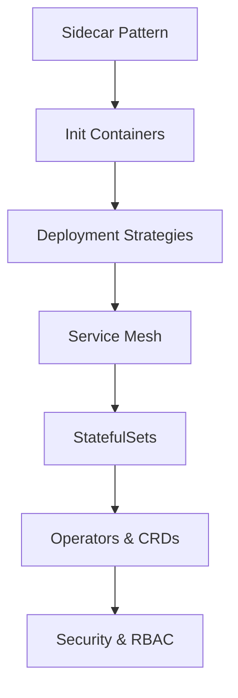

# Advanced Kubernetes Topics
## Production-Grade Patterns and Best Practices

---

## 📚 Topics Overview



---

## 1. Sidecar Pattern

### What is a Sidecar?
A sidecar container runs alongside your main application container in the same pod, extending or enhancing the main container's functionality.

### Common Use Cases
- **Logging**: Collect and forward logs
- **Monitoring**: Metrics collection
- **Security**: Proxy for mutual TLS
- **Configuration**: Dynamic config updates
- **Service Mesh**: Envoy proxy

### Example 1: Logging Sidecar

```yaml
apiVersion: v1
kind: Pod
metadata:
  name: app-with-logging
spec:
  containers:
  # Main application container
  - name: app
    image: myapp:1.0
    ports:
    - containerPort: 8080
    volumeMounts:
    - name: logs
      mountPath: /var/log/app
  
  # Sidecar: Log shipper
  - name: log-shipper
    image: fluentd:v1.14
    volumeMounts:
    - name: logs
      mountPath: /var/log/app
      readOnly: true
    - name: fluentd-config
      mountPath: /fluentd/etc
    env:
    - name: FLUENT_ELASTICSEARCH_HOST
      value: "elasticsearch.logging.svc"
    - name: FLUENT_ELASTICSEARCH_PORT
      value: "9200"
  
  volumes:
  - name: logs
    emptyDir: {}
  - name: fluentd-config
    configMap:
      name: fluentd-config
```

### Example 2: Metrics Sidecar

```yaml
apiVersion: apps/v1
kind: Deployment
metadata:
  name: app-with-metrics
spec:
  replicas: 3
  selector:
    matchLabels:
      app: myapp
  template:
    metadata:
      labels:
        app: myapp
      annotations:
        prometheus.io/scrape: "true"
        prometheus.io/port: "9090"
    spec:
      containers:
      # Main application
      - name: app
        image: myapp:1.0
        ports:
        - containerPort: 8080
      
      # Sidecar: Prometheus exporter
      - name: metrics-exporter
        image: prom/node-exporter:latest
        ports:
        - containerPort: 9090
          name: metrics
        resources:
          requests:
            memory: "64Mi"
            cpu: "50m"
          limits:
            memory: "128Mi"
            cpu: "100m"
```

### Example 3: Ambassador Pattern (Proxy Sidecar)

```yaml
apiVersion: v1
kind: Pod
metadata:
  name: app-with-proxy
spec:
  containers:
  # Main application
  - name: app
    image: myapp:1.0
    env:
    - name: DB_HOST
      value: "localhost"  # Connect via sidecar proxy
    - name: DB_PORT
      value: "5432"
  
  # Sidecar: Cloud SQL Proxy
  - name: cloudsql-proxy
    image: gcr.io/cloudsql-docker/gce-proxy:latest
    command:
      - "/cloud_sql_proxy"
      - "-instances=myproject:us-central1:mydb=tcp:5432"
    securityContext:
      runAsNonRoot: true
    resources:
      requests:
        memory: "64Mi"
        cpu: "50m"
```

---

## 2. Init Containers

### Purpose
Init containers run before app containers and must complete successfully before the app starts.

### Use Cases
- Database migrations
- Configuration setup
- Dependency checks
- Secret decryption
- Data population

### Example 1: Database Migration Init Container

```yaml
apiVersion: apps/v1
kind: Deployment
metadata:
  name: web-app
spec:
  replicas: 3
  selector:
    matchLabels:
      app: web
  template:
    metadata:
      labels:
        app: web
    spec:
      # Init container: Run migrations
      initContainers:
      - name: migrate-db
        image: myapp-migrations:v1
        command: ['sh', '-c']
        args:
          - |
            echo "Running database migrations..."
            npm run migrate
            echo "Migrations complete"
        env:
        - name: DATABASE_URL
          valueFrom:
            secretKeyRef:
              name: db-secret
              key: url
      
      # Main application containers
      containers:
      - name: web
        image: myapp:v1
        ports:
        - containerPort: 8080
        env:
        - name: DATABASE_URL
          valueFrom:
            secretKeyRef:
              name: db-secret
              key: url
```

### Example 2: Wait for Dependencies

```yaml
apiVersion: v1
kind: Pod
metadata:
  name: app-with-dependencies
spec:
  initContainers:
  # Wait for database to be ready
  - name: wait-for-db
    image: busybox:1.35
    command: ['sh', '-c']
    args:
      - |
        until nc -z postgres-service 5432; do
          echo "Waiting for database..."
          sleep 2
        done
        echo "Database is ready!"
  
  # Wait for Redis
  - name: wait-for-redis
    image: busybox:1.35
    command: ['sh', '-c']
    args:
      - |
        until nc -z redis-service 6379; do
          echo "Waiting for Redis..."
          sleep 2
        done
        echo "Redis is ready!"
  
  containers:
  - name: app
    image: myapp:1.0
    ports:
    - containerPort: 8080
```

### Example 3: Configuration Setup

```yaml
apiVersion: v1
kind: Pod
metadata:
  name: app-with-config
spec:
  initContainers:
  - name: setup-config
    image: busybox:1.35
    command: ['sh', '-c']
    args:
      - |
        echo "Generating configuration..."
        cat > /config/app.conf <<EOF
        environment=${ENV}
        log_level=${LOG_LEVEL}
        api_endpoint=${API_ENDPOINT}
        EOF
        echo "Configuration ready"
    env:
    - name: ENV
      value: "production"
    - name: LOG_LEVEL
      value: "info"
    - name: API_ENDPOINT
      value: "https://api.example.com"
    volumeMounts:
    - name: config
      mountPath: /config
  
  containers:
  - name: app
    image: myapp:1.0
    volumeMounts:
    - name: config
      mountPath: /etc/app
  
  volumes:
  - name: config
    emptyDir: {}
```

---

## 3. Advanced Deployment Strategies

### Strategy 1: Canary Deployment

**Concept**: Gradually shift traffic from old to new version

```yaml
# Stable version (90% traffic)
apiVersion: apps/v1
kind: Deployment
metadata:
  name: myapp-stable
  labels:
    app: myapp
spec:
  replicas: 9
  selector:
    matchLabels:
      app: myapp
      version: stable
  template:
    metadata:
      labels:
        app: myapp
        version: stable
    spec:
      containers:
      - name: app
        image: myapp:v1.0
        ports:
        - containerPort: 8080

---
# Canary version (10% traffic)
apiVersion: apps/v1
kind: Deployment
metadata:
  name: myapp-canary
  labels:
    app: myapp
spec:
  replicas: 1
  selector:
    matchLabels:
      app: myapp
      version: canary
  template:
    metadata:
      labels:
        app: myapp
        version: canary
    spec:
      containers:
      - name: app
        image: myapp:v2.0
        ports:
        - containerPort: 8080

---
# Service routes to both versions
apiVersion: v1
kind: Service
metadata:
  name: myapp-service
spec:
  selector:
    app: myapp  # Matches both stable and canary
  ports:
  - port: 80
    targetPort: 8080
```

**Canary with Flagger (Progressive Delivery)**:
```yaml
apiVersion: flagger.app/v1beta1
kind: Canary
metadata:
  name: myapp
  namespace: production
spec:
  targetRef:
    apiVersion: apps/v1
    kind: Deployment
    name: myapp
  service:
    port: 80
  analysis:
    interval: 1m
    threshold: 5
    maxWeight: 50
    stepWeight: 10
    metrics:
    - name: request-success-rate
      thresholdRange:
        min: 99
      interval: 1m
    - name: request-duration
      thresholdRange:
        max: 500
      interval: 1m
    webhooks:
    - name: load-test
      url: http://flagger-loadtester/
      metadata:
        cmd: "hey -z 1m -q 10 -c 2 http://myapp-canary/"
```

### Strategy 2: Blue-Green Deployment

```yaml
# Blue deployment (current production)
apiVersion: apps/v1
kind: Deployment
metadata:
  name: myapp-blue
  namespace: production
spec:
  replicas: 5
  selector:
    matchLabels:
      app: myapp
      color: blue
  template:
    metadata:
      labels:
        app: myapp
        color: blue
        version: v1
    spec:
      containers:
      - name: app
        image: myapp:v1.0
        ports:
        - containerPort: 8080
        resources:
          requests:
            memory: "256Mi"
            cpu: "200m"
          limits:
            memory: "512Mi"
            cpu: "400m"

---
# Green deployment (new version)
apiVersion: apps/v1
kind: Deployment
metadata:
  name: myapp-green
  namespace: production
spec:
  replicas: 5
  selector:
    matchLabels:
      app: myapp
      color: green
  template:
    metadata:
      labels:
        app: myapp
        color: green
        version: v2
    spec:
      containers:
      - name: app
        image: myapp:v2.0
        ports:
        - containerPort: 8080
        resources:
          requests:
            memory: "256Mi"
            cpu: "200m"
          limits:
            memory: "512Mi"
            cpu: "400m"

---
# Service (controls traffic routing)
apiVersion: v1
kind: Service
metadata:
  name: myapp-service
  namespace: production
spec:
  selector:
    app: myapp
    color: blue  # Switch to 'green' when ready
  ports:
  - port: 80
    targetPort: 8080
  type: LoadBalancer
```

**Switching Script**:
```bash
#!/bin/bash
# blue-green-switch.sh

# Test green deployment
echo "Testing green deployment..."
kubectl port-forward deployment/myapp-green 9090:8080 &
PF_PID=$!
sleep 3

# Run tests
if curl -f http://localhost:9090/health; then
  echo "Green deployment is healthy"
  kill $PF_PID
  
  # Switch traffic to green
  echo "Switching traffic to green..."
  kubectl patch service myapp-service -p '{"spec":{"selector":{"color":"green"}}}'
  
  echo "Traffic switched to green deployment"
  echo "Monitor for issues, then delete blue deployment:"
  echo "kubectl delete deployment myapp-blue"
else
  echo "Green deployment failed health check!"
  kill $PF_PID
  exit 1
fi
```

### Strategy 3: A/B Testing with Header-Based Routing

```yaml
# Using Istio for A/B testing
apiVersion: networking.istio.io/v1alpha3
kind: VirtualService
metadata:
  name: myapp-ab-test
spec:
  hosts:
  - myapp.example.com
  http:
  # Route beta users to v2
  - match:
    - headers:
        user-type:
          exact: beta
    route:
    - destination:
        host: myapp-service
        subset: v2
  
  # Route mobile users to v2
  - match:
    - headers:
        user-agent:
          regex: ".*Mobile.*"
    route:
    - destination:
        host: myapp-service
        subset: v2
      weight: 50
    - destination:
        host: myapp-service
        subset: v1
      weight: 50
  
  # Default route (v1)
  - route:
    - destination:
        host: myapp-service
        subset: v1

---
apiVersion: networking.istio.io/v1alpha3
kind: DestinationRule
metadata:
  name: myapp-versions
spec:
  host: myapp-service
  subsets:
  - name: v1
    labels:
      version: v1
  - name: v2
    labels:
      version: v2
```

---

## 4. Service Mesh (Istio)

### What is a Service Mesh?
A dedicated infrastructure layer for handling service-to-service communication, providing:
- Traffic management
- Security (mTLS)
- Observability
- Resilience

### Installing Istio

```bash
# Download Istio
curl -L https://istio.io/downloadIstio | sh -
cd istio-*
export PATH=$PWD/bin:$PATH

# Install Istio
istioctl install --set profile=demo -y

# Enable sidecar injection for namespace
kubectl label namespace default istio-injection=enabled
```

### Example 1: Traffic Splitting

```yaml
apiVersion: networking.istio.io/v1alpha3
kind: VirtualService
metadata:
  name: myapp-traffic-split
spec:
  hosts:
  - myapp.example.com
  http:
  - match:
    - uri:
        prefix: /api
    route:
    - destination:
        host: myapp-service
        subset: v1
      weight: 80
    - destination:
        host: myapp-service
        subset: v2
      weight: 20
    timeout: 10s
    retries:
      attempts: 3
      perTryTimeout: 2s

---
apiVersion: networking.istio.io/v1alpha3
kind: DestinationRule
metadata:
  name: myapp-circuit-breaker
spec:
  host: myapp-service
  trafficPolicy:
    connectionPool:
      tcp:
        maxConnections: 100
      http:
        http1MaxPendingRequests: 50
        maxRequestsPerConnection: 2
    outlierDetection:
      consecutiveErrors: 5
      interval: 30s
      baseEjectionTime: 30s
      maxEjectionPercent: 50
  subsets:
  - name: v1
    labels:
      version: v1
  - name: v2
    labels:
      version: v2
```

### Example 2: Mutual TLS

```yaml
# Enable strict mTLS for namespace
apiVersion: security.istio.io/v1beta1
kind: PeerAuthentication
metadata:
  name: default
  namespace: production
spec:
  mtls:
    mode: STRICT

---
# Authorization policy
apiVersion: security.istio.io/v1beta1
kind: AuthorizationPolicy
metadata:
  name: myapp-authz
  namespace: production
spec:
  selector:
    matchLabels:
      app: myapp
  action: ALLOW
  rules:
  - from:
    - source:
        principals: ["cluster.local/ns/production/sa/frontend"]
    to:
    - operation:
        methods: ["GET", "POST"]
        paths: ["/api/*"]
```

### Example 3: Rate Limiting

```yaml
apiVersion: networking.istio.io/v1alpha3
kind: EnvoyFilter
metadata:
  name: rate-limit-filter
  namespace: istio-system
spec:
  workloadSelector:
    labels:
      app: myapp
  configPatches:
  - applyTo: HTTP_FILTER
    match:
      context: SIDECAR_INBOUND
    patch:
      operation: INSERT_BEFORE
      value:
        name: envoy.filters.http.local_ratelimit
        typed_config:
          "@type": type.googleapis.com/envoy.extensions.filters.http.local_ratelimit.v3.LocalRateLimit
          stat_prefix: http_local_rate_limiter
          token_bucket:
            max_tokens: 100
            tokens_per_fill: 100
            fill_interval: 1s
          filter_enabled:
            runtime_key: local_rate_limit_enabled
            default_value:
              numerator: 100
              denominator: HUNDRED
```

### Observability with Istio

```yaml
# Install monitoring stack
kubectl apply -f https://raw.githubusercontent.com/istio/istio/release-1.20/samples/addons/prometheus.yaml
kubectl apply -f https://raw.githubusercontent.com/istio/istio/release-1.20/samples/addons/grafana.yaml
kubectl apply -f https://raw.githubusercontent.com/istio/istio/release-1.20/samples/addons/kiali.yaml
kubectl apply -f https://raw.githubusercontent.com/istio/istio/release-1.20/samples/addons/jaeger.yaml

# Access dashboards
istioctl dashboard kiali
istioctl dashboard grafana
istioctl dashboard jaeger
```

---

## 5. StatefulSets & Operators

### StatefulSet Example: Kafka Cluster

```yaml
apiVersion: v1
kind: Service
metadata:
  name: kafka-headless
spec:
  clusterIP: None
  selector:
    app: kafka
  ports:
  - port: 9092
    name: client
  - port: 9093
    name: internal

---
apiVersion: apps/v1
kind: StatefulSet
metadata:
  name: kafka
spec:
  serviceName: kafka-headless
  replicas: 3
  selector:
    matchLabels:
      app: kafka
  template:
    metadata:
      labels:
        app: kafka
    spec:
      containers:
      - name: kafka
        image: confluentinc/cp-kafka:7.5.0
        ports:
        - containerPort: 9092
          name: client
        - containerPort: 9093
          name: internal
        env:
        - name: KAFKA_BROKER_ID
          valueFrom:
            fieldRef:
              fieldPath: metadata.name
        - name: KAFKA_ZOOKEEPER_CONNECT
          value: "zk-0.zk-headless:2181,zk-1.zk-headless:2181,zk-2.zk-headless:2181"
        - name: KAFKA_ADVERTISED_LISTENERS
          value: "PLAINTEXT://$(POD_NAME).kafka-headless:9092"
        volumeMounts:
        - name: data
          mountPath: /var/lib/kafka/data
        resources:
          requests:
            memory: "2Gi"
            cpu: "1000m"
          limits:
            memory: "4Gi"
            cpu: "2000m"
  volumeClaimTemplates:
  - metadata:
      name: data
    spec:
      accessModes: ["ReadWriteOnce"]
      storageClassName: fast-ssd
      resources:
        requests:
          storage: 100Gi
```

### Custom Resource Definition (CRD)

```yaml
apiVersion: apiextensions.k8s.io/v1
kind: CustomResourceDefinition
metadata:
  name: applications.example.com
spec:
  group: example.com
  versions:
  - name: v1
    served: true
    storage: true
    schema:
      openAPIV3Schema:
        type: object
        properties:
          spec:
            type: object
            properties:
              replicas:
                type: integer
                minimum: 1
                maximum: 10
              image:
                type: string
              env:
                type: object
                additionalProperties:
                  type: string
  scope: Namespaced
  names:
    plural: applications
    singular: application
    kind: Application
    shortNames:
    - app

---
# Use the custom resource
apiVersion: example.com/v1
kind: Application
metadata:
  name: my-custom-app
spec:
  replicas: 3
  image: myapp:v1.0
  env:
    DATABASE_URL: "postgres://db:5432"
    LOG_LEVEL: "info"
```

### Simple Operator Example (Controller)

```go
// Simple operator controller in Go
package main

import (
    "context"
    "fmt"
    appsv1 "k8s.io/api/apps/v1"
    corev1 "k8s.io/api/core/v1"
    metav1 "k8s.io/apimachinery/pkg/apis/meta/v1"
)

type ApplicationReconciler struct {
    Client client.Client
}

func (r *ApplicationReconciler) Reconcile(ctx context.Context, req ctrl.Request) (ctrl.Result, error) {
    // Fetch the Application instance
    app := &examplev1.Application{}
    err := r.Client.Get(ctx, req.NamespacedName, app)
    if err != nil {
        return ctrl.Result{}, err
    }

    // Create Deployment
    deployment := &appsv1.Deployment{
        ObjectMeta: metav1.ObjectMeta{
            Name:      app.Name,
            Namespace: app.Namespace,
        },
        Spec: appsv1.DeploymentSpec{
            Replicas: &app.Spec.Replicas,
            Selector: &metav1.LabelSelector{
                MatchLabels: map[string]string{
                    "app": app.Name,
                },
            },
            Template: corev1.PodTemplateSpec{
                ObjectMeta: metav1.ObjectMeta{
                    Labels: map[string]string{
                        "app": app.Name,
                    },
                },
                Spec: corev1.PodSpec{
                    Containers: []corev1.Container{
                        {
                            Name:  "app",
                            Image: app.Spec.Image,
                            Env:   convertEnv(app.Spec.Env),
                        },
                    },
                },
            },
        },
    }

    // Create or update the deployment
    return ctrl.Result{}, r.Client.Create(ctx, deployment)
}
```

---

## 6. Advanced Security & RBAC

### Role-Based Access Control (RBAC)

```yaml
# Create a namespace-scoped role
apiVersion: rbac.authorization.k8s.io/v1
kind: Role
metadata:
  namespace: production
  name: pod-reader
rules:
- apiGroups: [""]
  resources: ["pods"]
  verbs: ["get", "list", "watch"]
- apiGroups: [""]
  resources: ["pods/log"]
  verbs: ["get"]

---
# Bind role to a user
apiVersion: rbac.authorization.k8s.io/v1
kind: RoleBinding
metadata:
  name: read-pods
  namespace: production
subjects:
- kind: User
  name: jane@example.com
  apiGroup: rbac.authorization.k8s.io
roleRef:
  kind: Role
  name: pod-reader
  apiGroup: rbac.authorization.k8s.io

---
# Cluster-wide role
apiVersion: rbac.authorization.k8s.io/v1
kind: ClusterRole
metadata:
  name: deployment-manager
rules:
- apiGroups: ["apps"]
  resources: ["deployments"]
  verbs: ["get", "list", "watch", "create", "update", "patch", "delete"]
- apiGroups: [""]
  resources: ["services"]
  verbs: ["get", "list", "create"]

---
# Service account for pods
apiVersion: v1
kind: ServiceAccount
metadata:
  name: app-service-account
  namespace: production

---
apiVersion: rbac.authorization.k8s.io/v1
kind: RoleBinding
metadata:
  name: app-deployment-manager
  namespace: production
subjects:
- kind: ServiceAccount
  name: app-service-account
  namespace: production
roleRef:
  kind: ClusterRole
  name: deployment-manager
  apiGroup: rbac.authorization.k8s.io
```

### Pod Security Standards

```yaml
# Pod Security Admission
apiVersion: v1
kind: Namespace
metadata:
  name: production
  labels:
    pod-security.kubernetes.io/enforce: restricted
    pod-security.kubernetes.io/audit: restricted
    pod-security.kubernetes.io/warn: restricted

---
# Secure pod configuration
apiVersion: v1
kind: Pod
metadata:
  name: secure-pod
  namespace: production
spec:
  serviceAccountName: app-service-account
  securityContext:
    runAsNonRoot: true
    runAsUser: 1000
    fsGroup: 2000
    seccompProfile:
      type: RuntimeDefault
  
  containers:
  - name: app
    image: myapp:1.0
    securityContext:
      allowPrivilegeEscalation: false
      readOnlyRootFilesystem: true
      capabilities:
        drop:
        - ALL
    volumeMounts:
    - name: tmp
      mountPath: /tmp
    - name: cache
      mountPath: /app/cache
    resources:
      requests:
        memory: "128Mi"
        cpu: "100m"
      limits:
        memory: "256Mi"
        cpu: "200m"
  
  volumes:
  - name: tmp
    emptyDir: {}
  - name: cache
    emptyDir: {}
```

### Network Policies

```yaml
# Default deny all ingress traffic
apiVersion: networking.k8s.io/v1
kind: NetworkPolicy
metadata:
  name: default-deny-ingress
  namespace: production
spec:
  podSelector: {}
  policyTypes:
  - Ingress

---
# Allow specific app-to-app communication
apiVersion: networking.k8s.io/v1
kind: NetworkPolicy
metadata:
  name: allow-frontend-to-backend
  namespace: production
spec:
  podSelector:
    matchLabels:
      app: backend
  policyTypes:
  - Ingress
  ingress:
  - from:
    - podSelector:
        matchLabels:
          app: frontend
    ports:
    - protocol: TCP
      port: 8080

---
# Allow from specific namespaces
apiVersion: networking.k8s.io/v1
kind: NetworkPolicy
metadata:
  name: allow-from-monitoring
  namespace: production
spec:
  podSelector:
    matchLabels:
      app: myapp
  policyTypes:
  - Ingress
  ingress:
  - from:
    - namespaceSelector:
        matchLabels:
          name: monitoring
    ports:
    - protocol: TCP
      port: 9090
```

---

## 7. Advanced Observability

### Custom Metrics with Prometheus

```yaml
# ServiceMonitor for custom app metrics
apiVersion: monitoring.coreos.com/v1
kind: ServiceMonitor
metadata:
  name: myapp-metrics
  namespace: production
spec:
  selector:
    matchLabels:
      app: myapp
  endpoints:
  - port: metrics
    interval: 30s
    path: /metrics

---
# PrometheusRule for alerting
apiVersion: monitoring.coreos.com/v1
kind: PrometheusRule
metadata:
  name: myapp-alerts
  namespace: production
spec:
  groups:
  - name: myapp
    interval: 30s
    rules:
    - alert: HighErrorRate
      expr: |
        rate(http_requests_total{status=~"5.."}[5m]) > 0.05
      for: 5m
      labels:
        severity: critical
      annotations:
        summary: "High error rate detected"
        description: "Error rate is {{ $value }} for {{ $labels.instance }}"
    
    - alert: HighMemoryUsage
      expr: |
        container_memory_usage_bytes{pod=~"myapp-.*"} / 
        container_spec_memory_limit_bytes{pod=~"myapp-.*"} > 0.9
      for: 5m
      labels:
        severity: warning
      annotations:
        summary: "High memory usage"
        description: "Pod {{ $labels.pod }} is using {{ $value }}% memory"
```

---

## 8. Interview Questions - Advanced Topics

**Q: Explain the difference between sidecar and init containers**
> - **Init containers**: Run sequentially before app containers, must complete successfully
> - **Sidecar containers**: Run concurrently with app containers throughout pod lifecycle

**Q: When would you use StatefulSet vs Deployment?**
> - **StatefulSet**: Databases, message queues - needs stable network IDs, ordered deployment, persistent storage
> - **Deployment**: Stateless apps - pods are interchangeable, can scale up/down freely

**Q: What problems does a service mesh solve?**
> - Traffic management (routing, load balancing, retries)
> - Security (mTLS, authorization)
> - Observability (distributed tracing, metrics)
> - Resilience (circuit breaking, rate limiting)

**Q: How does Istio work?**
> Injects Envoy proxy sidecar into each pod, intercepts all network traffic, applies policies, collects telemetry

**Q: What are CRDs and why use them?**
> Custom Resource Definitions extend Kubernetes API with domain-specific resources. Use for building operators and custom controllers.

**Q: Explain blue-green vs canary deployment**
> - **Blue-Green**: Two identical environments, instant switch, easy rollback, requires 2x resources
> - **Canary**: Gradual traffic shift, reduces risk, harder to implement, less resources

**Q: How do you implement zero-downtime deployments?**
> - Proper readiness probes
> - Rolling update strategy with maxUnavailable: 0
> - Pre-stop hooks for graceful shutdown
> - Connection draining

**Q: What is the difference between PodDisruptionBudget and resource limits?**
> - **PodDisruptionBudget**: Controls voluntary disruptions during maintenance
> - **Resource limits**: Controls resource consumption per container

---

## Quick Reference

### Advanced Patterns Cheat Sheet

```bash
# Sidecar pattern
kubectl apply -f pod-with-sidecar.yaml
kubectl logs pod-name -c sidecar-container

# Traffic splitting with Istio
kubectl apply -f virtualservice.yaml
kubectl get virtualservices

# StatefulSet operations
kubectl scale statefulset kafka --replicas=5
kubectl delete pod kafka-0  # Will recreate with same identity

# CRD operations
kubectl get crd
kubectl get applications
kubectl describe application my-app

# RBAC checks
kubectl auth can-i create deployments --as jane@example.com
kubectl auth can-i --list --as system:serviceaccount:default:app-sa
```

---

> [!IMPORTANT]
> **Production Readiness Checklist**:
> - ✅ Implement proper health checks (liveness & readiness)
> - ✅ Set resource requests and limits
> - ✅ Use pod disruption budgets
> - ✅ Implement network policies
> - ✅ Enable RBAC with least privilege
> - ✅ Use service mesh for mTLS
> - ✅ Set up comprehensive monitoring
> - ✅ Implement automated deployment strategies

> [!TIP]
> **Interview Preparation**:
> Practice explaining these concepts with real-world examples from your experience. Be ready to whiteboard architecture diagrams and discuss tradeoffs.

---

## Next Steps

- [ ] Deploy sample app with Istio service mesh
- [ ] Create a custom operator with Kubebuilder
- [ ] Implement canary deployment with Flagger
- [ ] Practice troubleshooting service mesh issues
- [ ] Build secure multi-tenant cluster with RBAC

Good luck mastering advanced Kubernetes! 🚀
