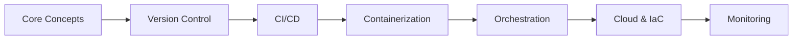

# DevOps Interview Preparation Guide
## For 3+ Years Experience | Basics to Advanced

---

## 📊 Interview Preparation Roadmap



---

## 1. Core DevOps Concepts

### What is DevOps?
DevOps is a culture combining development and operations to improve collaboration, automate processes, and deliver software faster and more reliably.

### Key Principles
- **Continuous Integration/Continuous Deployment (CI/CD)**
- **Infrastructure as Code (IaC)**
- **Monitoring and Logging**
- **Automation**
- **Collaboration**

### Common Interview Questions

**Q: Explain the DevOps lifecycle**
> Development → Build → Test → Deploy → Operate → Monitor → Plan (continuous loop)

**Q: Difference between DevOps and Agile?**
> Agile focuses on iterative development; DevOps extends this to operations, emphasizing automation and continuous delivery.

**Q: What are the key metrics in DevOps?**
> - Deployment frequency
> - Lead time for changes
> - Mean time to recovery (MTTR)
> - Change failure rate

---

## 2. Version Control (Git)

### Essential Git Commands
```bash
# Branching strategy
git checkout -b feature/new-feature
git merge main
git rebase main

# Handling conflicts
git status
git diff
git add <file>
git commit -m "Resolved merge conflict"

# Viewing history
git log --oneline --graph
git reflog
git show <commit-hash>

# Undoing changes
git reset --soft HEAD~1    # Undo commit, keep changes
git reset --hard HEAD~1    # Undo commit, discard changes
git revert <commit-hash>   # Create new commit that undoes
```

### Git Workflows

**GitFlow**: main, develop, feature, release, hotfix branches
**Trunk-Based**: Short-lived feature branches, frequent merges to main

### Interview Questions

**Q: Difference between git merge and git rebase?**
> - **Merge**: Creates a merge commit, preserves history
> - **Rebase**: Rewrites history, creates linear history

**Q: How to resolve merge conflicts?**
> 1. Identify conflicts (`git status`)
> 2. Edit conflicting files
> 3. Stage resolved files (`git add`)
> 4. Complete merge (`git commit`)

**Q: What is git cherry-pick?**
> Applies specific commits from one branch to another without merging entire branch.

---

## 3. Linux & Shell Scripting

### Essential Linux Commands
```bash
# Process management
ps aux | grep <process>
top / htop
kill -9 <PID>
systemctl status <service>

# File operations
find / -name "*.log" -mtime +7 -delete
grep -r "error" /var/log/
awk '{print $1}' file.txt
sed 's/old/new/g' file.txt

# Network
netstat -tuln
ss -tuln
curl -X GET http://api.example.com
wget https://example.com/file.tar.gz

# Disk & resources
df -h
du -sh /var/log/
free -m
lsblk
```

### Bash Scripting Example
```bash
#!/bin/bash

# Deployment script
APP_NAME="myapp"
VERSION=$1
DEPLOY_DIR="/opt/apps"

if [ -z "$VERSION" ]; then
  echo "Usage: $0 <version>"
  exit 1
fi

echo "Deploying $APP_NAME version $VERSION"

# Backup current version
cp -r $DEPLOY_DIR/$APP_NAME $DEPLOY_DIR/${APP_NAME}_backup_$(date +%Y%m%d)

# Deploy new version
docker pull $APP_NAME:$VERSION
docker stop $APP_NAME || true
docker rm $APP_NAME || true
docker run -d --name $APP_NAME -p 8080:8080 $APP_NAME:$VERSION

# Health check
sleep 5
if curl -f http://localhost:8080/health; then
  echo "Deployment successful"
  exit 0
else
  echo "Deployment failed, rolling back"
  docker stop $APP_NAME
  docker run -d --name $APP_NAME -p 8080:8080 $APP_NAME:previous
  exit 1
fi
```

---

## 4. Docker & Containerization

### Core Concepts
- **Image**: Read-only template
- **Container**: Running instance of an image
- **Dockerfile**: Instructions to build image
- **Registry**: Storage for images (Docker Hub, ECR, GCR)

### Docker Commands
```bash
# Image management
docker build -t myapp:v1 .
docker images
docker rmi myapp:v1
docker tag myapp:v1 myrepo/myapp:v1
docker push myrepo/myapp:v1

# Container lifecycle
docker run -d -p 8080:80 --name web nginx
docker ps / docker ps -a
docker start/stop/restart web
docker logs -f web
docker exec -it web bash
docker inspect web
docker rm -f web

# Cleanup
docker system prune -a
docker volume prune
docker network prune

# Multi-stage build
docker build --target production -t myapp:prod .
```

### Production Dockerfile
```dockerfile
# Multi-stage build
FROM node:18-alpine AS builder
WORKDIR /app
COPY package*.json ./
RUN npm ci --only=production
COPY . .
RUN npm run build

FROM node:18-alpine
WORKDIR /app
COPY --from=builder /app/dist ./dist
COPY --from=builder /app/node_modules ./node_modules
COPY package*.json ./

# Security best practices
RUN addgroup -g 1001 -S nodejs && \
    adduser -S nodejs -u 1001
USER nodejs

# Health check
HEALTHCHECK --interval=30s --timeout=3s \
  CMD node healthcheck.js

EXPOSE 3000
CMD ["node", "dist/server.js"]
```

### docker-compose.yml
```yaml
version: '3.8'

services:
  app:
    build: .
    ports:
      - "3000:3000"
    environment:
      - NODE_ENV=production
      - DB_HOST=postgres
    depends_on:
      postgres:
        condition: service_healthy
    restart: unless-stopped
    networks:
      - app-network

  postgres:
    image: postgres:15-alpine
    environment:
      - POSTGRES_PASSWORD=${DB_PASSWORD}
    volumes:
      - pgdata:/var/lib/postgresql/data
    healthcheck:
      test: ["CMD-SHELL", "pg_isready -U postgres"]
      interval: 10s
      timeout: 5s
      retries: 5
    networks:
      - app-network

  nginx:
    image: nginx:alpine
    ports:
      - "80:80"
    volumes:
      - ./nginx.conf:/etc/nginx/nginx.conf:ro
    depends_on:
      - app
    networks:
      - app-network

volumes:
  pgdata:

networks:
  app-network:
    driver: bridge
```

### Interview Questions

**Q: Difference between CMD and ENTRYPOINT?**
> - **CMD**: Default command, can be overridden
> - **ENTRYPOINT**: Main command, arguments appended

**Q: What is Docker layer caching?**
> Docker caches each layer. Optimize by putting frequently changing instructions (like COPY code) last.

**Q: How to reduce Docker image size?**
> - Use alpine base images
> - Multi-stage builds
> - Combine RUN commands
> - Remove unnecessary files
> - Use .dockerignore

**Q: Container vs VM?**
> Containers share host OS kernel (lightweight, faster), VMs include full OS (isolated, heavier).

---

## 5. Kubernetes

### Architecture Components

**Control Plane**: API Server, Scheduler, Controller Manager, etcd
**Worker Nodes**: Kubelet, Kube-proxy, Container Runtime

### Core Resources

#### Deployment
```yaml
apiVersion: apps/v1
kind: Deployment
metadata:
  name: myapp
spec:
  replicas: 3
  strategy:
    type: RollingUpdate
    rollingUpdate:
      maxSurge: 1
      maxUnavailable: 0
  selector:
    matchLabels:
      app: myapp
  template:
    metadata:
      labels:
        app: myapp
        version: v1
    spec:
      containers:
      - name: app
        image: myapp:v1
        ports:
        - containerPort: 8080
        resources:
          requests:
            memory: "128Mi"
            cpu: "100m"
          limits:
            memory: "256Mi"
            cpu: "200m"
        livenessProbe:
          httpGet:
            path: /health
            port: 8080
          initialDelaySeconds: 30
          periodSeconds: 10
        readinessProbe:
          httpGet:
            path: /ready
            port: 8080
          initialDelaySeconds: 5
          periodSeconds: 5
        env:
        - name: DB_PASSWORD
          valueFrom:
            secretKeyRef:
              name: db-secret
              key: password
```

#### Service Types
```yaml
# ClusterIP (internal)
apiVersion: v1
kind: Service
metadata:
  name: backend-svc
spec:
  type: ClusterIP
  selector:
    app: backend
  ports:
  - port: 80
    targetPort: 8080

---
# LoadBalancer (external)
apiVersion: v1
kind: Service
metadata:
  name: frontend-svc
spec:
  type: LoadBalancer
  selector:
    app: frontend
  ports:
  - port: 80
    targetPort: 3000
```

#### ConfigMap & Secret
```yaml
apiVersion: v1
kind: ConfigMap
metadata:
  name: app-config
data:
  APP_ENV: "production"
  LOG_LEVEL: "info"

---
apiVersion: v1
kind: Secret
metadata:
  name: db-secret
type: Opaque
data:
  password: cGFzc3dvcmQxMjM=  # base64 encoded
```

#### Ingress
```yaml
apiVersion: networking.k8s.io/v1
kind: Ingress
metadata:
  name: app-ingress
  annotations:
    cert-manager.io/cluster-issuer: "letsencrypt-prod"
    nginx.ingress.kubernetes.io/ssl-redirect: "true"
spec:
  ingressClassName: nginx
  tls:
  - hosts:
    - app.example.com
    secretName: app-tls
  rules:
  - host: app.example.com
    http:
      paths:
      - path: /api
        pathType: Prefix
        backend:
          service:
            name: backend-svc
            port:
              number: 80
      - path: /
        pathType: Prefix
        backend:
          service:
            name: frontend-svc
            port:
              number: 80
```

### Essential kubectl Commands
```bash
# Cluster & context
kubectl config get-contexts
kubectl config use-context prod-cluster
kubectl cluster-info

# Resources
kubectl get pods -o wide --all-namespaces
kubectl describe pod <pod-name>
kubectl logs <pod-name> -f --tail=100
kubectl exec -it <pod-name> -- /bin/sh

# Deployments
kubectl apply -f deployment.yaml
kubectl rollout status deployment/myapp
kubectl rollout history deployment/myapp
kubectl rollout undo deployment/myapp
kubectl scale deployment myapp --replicas=5

# Debugging
kubectl get events --sort-by=.metadata.creationTimestamp
kubectl top nodes
kubectl top pods
kubectl port-forward pod/myapp-xxx 8080:8080

# Edit resources
kubectl edit deployment myapp
kubectl patch deployment myapp -p '{"spec":{"replicas":5}}'
```

### Interview Questions

**Q: Difference between Deployment and StatefulSet?**
> - **Deployment**: Stateless apps, pods are interchangeable
> - **StatefulSet**: Stateful apps, stable network IDs, ordered deployment

**Q: What is a DaemonSet?**
> Ensures one pod runs on each node (e.g., log collectors, monitoring agents)

**Q: How does Kubernetes service discovery work?**
> DNS-based: `<service-name>.<namespace>.svc.cluster.local`

**Q: Explain Pod lifecycle**
> Pending → Running → Succeeded/Failed → Terminating

**Q: How to handle secrets securely?**
> - Use external secret managers (Vault, AWS Secrets Manager)
> - Encrypt etcd at rest
> - RBAC for access control
> - Sealed Secrets operator

**Q: Rolling update vs Recreate strategy?**
> - **RollingUpdate**: Gradual replacement, zero downtime
> - **Recreate**: Delete all, then create new, has downtime

---

## 6. CI/CD Pipelines

### GitHub Actions Example
```yaml
name: CI/CD Pipeline

on:
  push:
    branches: [main, develop]
  pull_request:
    branches: [main]

env:
  REGISTRY: ghcr.io
  IMAGE_NAME: ${{ github.repository }}

jobs:
  test:
    runs-on: ubuntu-latest
    steps:
      - uses: actions/checkout@v3
      
      - name: Setup Node.js
        uses: actions/setup-node@v3
        with:
          node-version: '18'
          cache: 'npm'
      
      - run: npm ci
      - run: npm run lint
      - run: npm test
      - run: npm run build

  build-push:
    needs: test
    runs-on: ubuntu-latest
    if: github.ref == 'refs/heads/main'
    permissions:
      contents: read
      packages: write
    
    steps:
      - uses: actions/checkout@v3
      
      - name: Log in to Container Registry
        uses: docker/login-action@v2
        with:
          registry: ${{ env.REGISTRY }}
          username: ${{ github.actor }}
          password: ${{ secrets.GITHUB_TOKEN }}
      
      - name: Extract metadata
        id: meta
        uses: docker/metadata-action@v4
        with:
          images: ${{ env.REGISTRY }}/${{ env.IMAGE_NAME }}
          tags: |
            type=sha,prefix={{branch}}-
            type=semver,pattern={{version}}
      
      - name: Build and push
        uses: docker/build-push-action@v4
        with:
          context: .
          push: true
          tags: ${{ steps.meta.outputs.tags }}
          cache-from: type=gha
          cache-to: type=gha,mode=max

  deploy:
    needs: build-push
    runs-on: ubuntu-latest
    steps:
      - uses: actions/checkout@v3
      
      - name: Configure kubectl
        run: |
          echo "${{ secrets.KUBECONFIG }}" | base64 -d > kubeconfig
          export KUBECONFIG=./kubeconfig
      
      - name: Deploy to Kubernetes
        run: |
          kubectl set image deployment/myapp \
            app=${{ env.REGISTRY }}/${{ env.IMAGE_NAME }}:${{ github.sha }}
          kubectl rollout status deployment/myapp
```

### Jenkins Pipeline
```groovy
pipeline {
    agent any
    
    environment {
        DOCKER_REGISTRY = 'myregistry.io'
        IMAGE_NAME = 'myapp'
        KUBECONFIG = credentials('kubeconfig')
    }
    
    stages {
        stage('Checkout') {
            steps {
                git branch: 'main', url: 'https://github.com/user/repo.git'
            }
        }
        
        stage('Test') {
            steps {
                sh 'npm ci'
                sh 'npm run lint'
                sh 'npm test'
            }
        }
        
        stage('Build Docker Image') {
            steps {
                script {
                    dockerImage = docker.build("${DOCKER_REGISTRY}/${IMAGE_NAME}:${BUILD_NUMBER}")
                }
            }
        }
        
        stage('Push to Registry') {
            steps {
                script {
                    docker.withRegistry("https://${DOCKER_REGISTRY}", 'docker-credentials') {
                        dockerImage.push()
                        dockerImage.push('latest')
                    }
                }
            }
        }
        
        stage('Deploy to K8s') {
            steps {
                sh """
                    kubectl set image deployment/myapp \
                      app=${DOCKER_REGISTRY}/${IMAGE_NAME}:${BUILD_NUMBER}
                    kubectl rollout status deployment/myapp
                """
            }
        }
    }
    
    post {
        success {
            slackSend color: 'good', message: "Deployment successful: ${env.JOB_NAME} #${env.BUILD_NUMBER}"
        }
        failure {
            slackSend color: 'danger', message: "Deployment failed: ${env.JOB_NAME} #${env.BUILD_NUMBER}"
        }
    }
}
```

### Interview Questions

**Q: Blue-Green vs Canary deployment?**
> - **Blue-Green**: Two identical environments, instant traffic switch
> - **Canary**: Gradual traffic shift to new version (e.g., 10%, 50%, 100%)

**Q: What is GitOps?**
> Git as single source of truth; automated deployment when config changes (ArgoCD, FluxCD)

---

## 7. Infrastructure as Code

### Terraform Example
```hcl
# Provider
provider "aws" {
  region = "us-west-2"
}

# VPC
resource "aws_vpc" "main" {
  cidr_block = "10.0.0.0/16"
  
  tags = {
    Name = "main-vpc"
  }
}

# EKS Cluster
resource "aws_eks_cluster" "main" {
  name     = "my-cluster"
  role_arn = aws_iam_role.cluster.arn
  version  = "1.28"
  
  vpc_config {
    subnet_ids = aws_subnet.private[*].id
  }
}

# Outputs
output "cluster_endpoint" {
  value = aws_eks_cluster.main.endpoint
}
```

### Ansible Playbook
```yaml
---
- name: Configure web servers
  hosts: webservers
  become: yes
  
  tasks:
    - name: Install nginx
      apt:
        name: nginx
        state: present
        update_cache: yes
    
    - name: Copy nginx config
      template:
        src: nginx.conf.j2
        dest: /etc/nginx/nginx.conf
      notify: restart nginx
    
    - name: Start nginx
      service:
        name: nginx
        state: started
        enabled: yes
  
  handlers:
    - name: restart nginx
      service:
        name: nginx
        state: restarted
```

---

## 8. Monitoring & Logging

### Prometheus Query Examples
```promql
# CPU usage
rate(container_cpu_usage_seconds_total[5m])

# Memory usage
container_memory_usage_bytes / container_spec_memory_limit_bytes * 100

# Request rate
rate(http_requests_total[5m])

# Error rate
rate(http_requests_total{status=~"5.."}[5m])
```

### ELK Stack Query
```json
{
  "query": {
    "bool": {
      "must": [
        { "match": { "level": "ERROR" } },
        { "range": { "@timestamp": { "gte": "now-1h" } } }
      ]
    }
  }
}
```

---

## 9. Common Scenario-Based Questions

**Q: Application is slow in production. How do you troubleshoot?**
1. Check metrics (CPU, memory, disk I/O)
2. Review application logs
3. Check database performance
4. Network latency
5. Check for resource limits in Kubernetes
6. APM tools (New Relic, Datadog)

**Q: Pod keeps crashing. How to debug?**
```bash
kubectl logs <pod> --previous
kubectl describe pod <pod>
kubectl get events
kubectl exec -it <pod> -- sh  # If running
```

**Q: How to implement zero-downtime deployment?**
- Rolling updates with proper readiness/liveness probes
- Blue-green deployment
- Canary deployment with gradual traffic shift

**Q: Database migration during deployment?**
- Run migrations as init containers
- Use separate migration job before deployment
- Backward-compatible schema changes

---

## 10. Security Best Practices

### Container Security
- Use minimal base images (alpine)
- Scan images for vulnerabilities (Trivy, Snyk)
- Run as non-root user
- Read-only root filesystem
- Drop unnecessary capabilities

### Kubernetes Security
- RBAC for access control
- Network policies
- Pod security policies/standards
- Secret encryption at rest
- Regular security audits

---

## Quick Reference Card

### Docker Cheat Sheet
```bash
docker build -t app:v1 .
docker run -d -p 8080:80 --name web app:v1
docker logs -f web
docker exec -it web sh
docker-compose up -d
```

### Kubernetes Cheat Sheet
```bash
kubectl apply -f deployment.yaml
kubectl get pods -w
kubectl logs -f <pod>
kubectl scale deployment app --replicas=5
kubectl rollout restart deployment app
```

### Git Cheat Sheet
```bash
git checkout -b feature/xyz
git add . && git commit -m "msg"
git push origin feature/xyz
git rebase main
```

---

## Interview Preparation Checklist

- [ ] Understand CI/CD pipeline end-to-end
- [ ] Practice writing Dockerfiles
- [ ] Deploy app to Kubernetes cluster
- [ ] Set up monitoring with Prometheus
- [ ] Write Terraform/Ansible scripts
- [ ] Practice troubleshooting scenarios
- [ ] Review company's tech stack
- [ ] Prepare questions about team's practices

---

> [!IMPORTANT]
> **Focus Areas for 3+ Years Experience**:
> - Kubernetes production experience
> - CI/CD pipeline optimization
> - Infrastructure as Code
> - Security best practices
> - Monitoring and incident response

> [!TIP]
> Practice explaining your past projects using the STAR method (Situation, Task, Action, Result)

Good luck with your interview! 🚀
