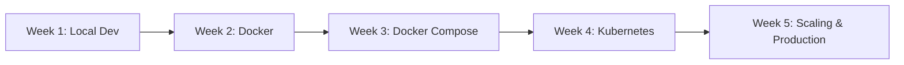
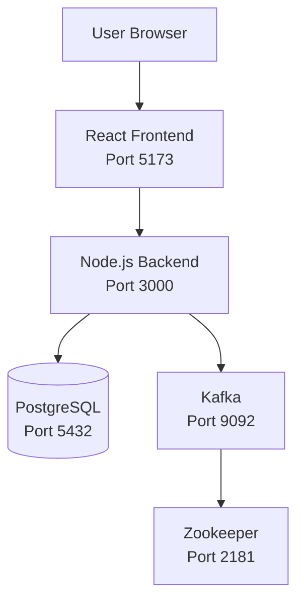
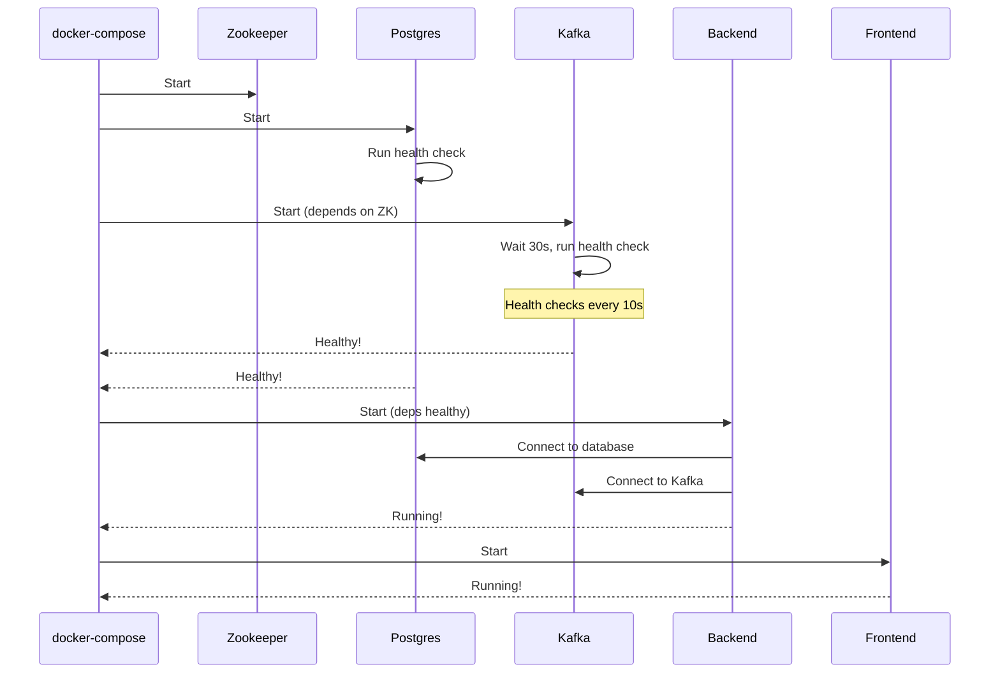
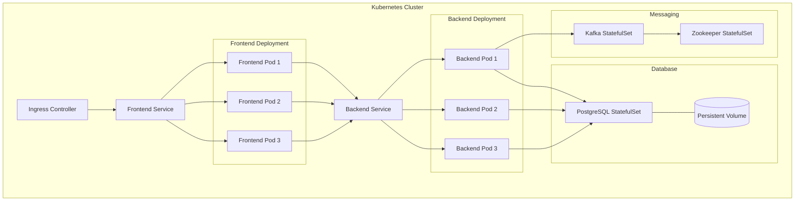

# E-Cart App: Complete DevOps Learning Guide
## From Code to Production - Step by Step

---

## 🎯 What You're Building

A **production-ready e-commerce application** with:
- **Frontend**: React UI for shopping
- **Backend**: Node.js API for business logic
- **Database**: PostgreSQL for data storage
- **Message Queue**: Kafka for async processing

This guide takes you from **local development → Docker → Kubernetes → Production**.

---

## 📋 Learning Path Overview



---

## Phase 1: Understanding the Application (Week 1)

### Architecture Diagram



### What Each Component Does

**Frontend (React)**:
- Shopping interface
- Product catalog display
- Shopping cart
- User interactions
- Talks to backend API

**Backend (Node.js)**:
- REST API endpoints
- Business logic (add to cart, checkout)
- Database queries
- Kafka message publishing
- Authentication/authorization

**PostgreSQL**:
- Stores products, users, orders
- Relational data with SQL
- ACID transactions

**Kafka**:
- Async message queue
- Order processing
- Email notifications
- Event streaming
- Needs Zookeeper for coordination

---

## Phase 2: Docker Basics (Week 2)

### Step 1: Understanding Dockerfiles

Your backend Dockerfile explained:

```dockerfile
# Build stage - Creates production files
FROM node:18-alpine AS builder
WORKDIR /app
COPY package*.json ./
RUN npm ci                    # Clean install
COPY . .
RUN npm run build            # Build TypeScript to JavaScript

# Production stage - Runs the app
FROM node:18-alpine
WORKDIR /app

# Copy only what's needed
COPY --from=builder /app/dist ./dist
COPY --from=builder /app/node_modules ./node_modules
COPY package*.json ./

# Security: Run as non-root user
RUN addgroup -g 1001 nodejs && \
    adduser -S nodejs -u 1001
USER nodejs

# Health check for container orchestration
HEALTHCHECK --interval=30s --timeout=3s \
  CMD node healthcheck.js

EXPOSE 3000
CMD ["node", "dist/server.js"]
```

**Why multi-stage build?**
- **Builder stage**: Has all dev dependencies, compiles code
- **Production stage**: Only has runtime dependencies
- Result: **Smaller image** (100MB vs 500MB)
- **More secure**: No dev tools in production

### Step 2: Build Docker Images

```powershell
# Navigate to your project
cd D:\Devops-Org\CD\e-cart-app

# Build backend image
docker build -t e-cart-backend:v1 ./backend

# Build frontend image
docker build -t e-cart-frontend:v1 ./frontend

# Verify images
docker images | findstr e-cart
```

### Step 3: Run Single Container (Testing)

```powershell
# Run backend (won't work fully without DB)
docker run -p 3000:3000 e-cart-backend:v1

# Run frontend
docker run -p 5173:80 e-cart-frontend:v1
```

**Why this fails**: Backend needs database and Kafka. That's why we use Docker Compose!

---

## Phase 3: Docker Compose (Week 3)

### Understanding docker-compose.yml

Your file explained section by section:

```yaml
services:
  postgres:
    image: postgres:15-alpine
    container_name: ecart-postgres
    environment:
      POSTGRES_USER: user
      POSTGRES_PASSWORD: password
      POSTGRES_DB: ecart
    ports:
      - "5432:5432"
    volumes:
      - postgres_data:/var/lib/postgresql/data
    healthcheck:
      test: ["CMD-SHELL", "pg_isready -U user -d ecart"]
      interval: 10s
      timeout: 5s
      retries: 5
    networks:
      - ecart-network
```

**Breaking it down**:
- `image`: Pre-built PostgreSQL from Docker Hub
- `environment`: Database credentials (in real prod, use secrets!)
- `ports`: Maps host 5432 to container 5432
- `volumes`: Persists data (survives container restarts)
- `healthcheck`: Kubernetes-style health verification
- `networks`: Custom network for service-to-service communication

**Why healthcheck?**
```yaml
backend:
  depends_on:
    postgres:
      condition: service_healthy  # Waits for health check!
```
Backend only starts AFTER Postgres is ready, preventing connection errors.

### The Full Startup Sequence



### Running the Stack

```powershell
# Start everything
docker-compose up -d

# Watch logs
docker-compose logs -f

# Check status (should see "healthy")
docker-compose ps

# Access the app
# Frontend: http://localhost:5173
# Backend API: http://localhost:3000
# Postgres: localhost:5432
```

### Common Commands

```powershell
# See running containers
docker-compose ps

# Stop everything
docker-compose down

# Stop and DELETE data volumes
docker-compose down -v

# Restart a single service
docker-compose restart backend

# View logs for specific service
docker-compose logs backend -f

# Scale a service (need to remove container_name!)
docker-compose up -d --scale backend=3

# Rebuild after code changes
docker-compose up -d --build
```

---

## Phase 4: Kubernetes Deployment (Week 4)

### Why Kubernetes?

**Docker Compose** is great for local dev, but production needs:
- ✅ **Auto-scaling**: Handle traffic spikes
- ✅ **Self-healing**: Restart crashed containers
- ✅ **Load balancing**: Distribute traffic
- ✅ **Rolling updates**: Zero downtime deployments
- ✅ **Resource limits**: Prevent resource hogging

**Kubernetes provides all of this!**

### Kubernetes Architecture for E-Cart



### Step 1: Create Kubernetes Manifests

Your project structure:
```
e-cart-app/
├── k8s/
│   ├── namespace.yaml
│   ├── postgres/
│   │   ├── statefulset.yaml
│   │   ├── service.yaml
│   │   └── pvc.yaml
│   ├── kafka/
│   │   ├── zookeeper.yaml
│   │   ├── kafka.yaml
│   │   └── services.yaml
│   ├── backend/
│   │   ├── deployment.yaml
│   │   ├── service.yaml
│   │   └── configmap.yaml
│   └── frontend/
│       ├── deployment.yaml
│       ├── service.yaml
│       └── ingress.yaml
```

### Step 2: Understand Key Manifests

**Backend Deployment** explained:

```yaml
apiVersion: apps/v1
kind: Deployment
metadata:
  name: backend
  namespace: ecart
spec:
  replicas: 3  # Run 3 instances
  strategy:
    type: RollingUpdate  # Zero-downtime updates
    rollingUpdate:
      maxSurge: 1        # Max 1 extra pod during update
      maxUnavailable: 0  # Always keep all pods running
  selector:
    matchLabels:
      app: backend
  template:
    metadata:
      labels:
        app: backend
        version: v1
    spec:
      containers:
      - name: backend
        image: your-registry/e-cart-backend:v1
        ports:
        - containerPort: 3000
        env:
        - name: DB_HOST
          value: postgres-service  # Service name!
        - name: DB_PASSWORD
          valueFrom:
            secretKeyRef:
              name: db-secret
              key: password
        resources:
          requests:
            memory: "256Mi"
            cpu: "250m"
          limits:
            memory: "512Mi"
            cpu: "500m"
        livenessProbe:
          httpGet:
            path: /health
            port: 3000
          initialDelaySeconds: 30
          periodSeconds: 10
        readinessProbe:
          httpGet:
            path: /ready
            port: 3000
          initialDelaySeconds: 5
          periodSeconds: 5
```

**Key concepts**:

**Replicas**: Number of pod copies
- More replicas = **higher availability**
- Load balanced automatically
- If one crashes, others handle traffic

**Rolling Update Strategy**:
```
Old pods: [v1] [v1] [v1]
Step 1:   [v1] [v1] [v1] [v2]  <- Create 1 new
Step 2:   [v1] [v1] [v2]       <- Delete 1 old
Step 3:   [v1] [v1] [v2] [v2]  <- Create another
Step 4:   [v1] [v2] [v2]       <- Delete old
Step 5:   [v2] [v2] [v2]       <- All updated!
```

**Resource Requests vs Limits**:
- **Requests**: Guaranteed resources (scheduler uses this)
- **Limits**: Maximum allowed (pod killed if exceeded)

**Health Probes**:
- **Liveness**: Is pod alive? Restart if fails
- **Readiness**: Is pod ready for traffic? Remove from service if fails

### Step 3: Deploy to Kubernetes

```powershell
# Create namespace
kubectl apply -f k8s/namespace.yaml

# Deploy database first
kubectl apply -f k8s/postgres/

# Deploy Kafka/Zookeeper
kubectl apply -f k8s/kafka/

# Wait for database to be ready
kubectl get pods -n ecart -w

# Deploy backend
kubectl apply -f k8s/backend/

# Deploy frontend
kubectl apply -f k8s/frontend/

# Check everything
kubectl get all -n ecart
```

### Step 4: Access Your Application

```powershell
# Port forward to frontend
kubectl port-forward -n ecart svc/frontend-service 8080:80

# Open browser
http://localhost:8080
```

---

## Phase 5: Scaling & Production (Week 5)

### Horizontal Pod Autoscaler (HPA)

```yaml
apiVersion: autoscaling/v2
kind: HorizontalPodAutoscaler
metadata:
  name: backend-hpa
  namespace: ecart
spec:
  scaleTargetRef:
    apiVersion: apps/v1
    kind: Deployment
    name: backend
  minReplicas: 3
  maxReplicas: 10
  metrics:
  - type: Resource
    resource:
      name: cpu
      target:
        type: Utilization
        averageUtilization: 70
```

**What happens**:
- Low traffic: 3 pods
- CPU > 70%: Scales up (adds pods)
- CPU < 70%: Scales down (removes pods)
- Max 10 pods

### Load Testing

```powershell
# Install hey (HTTP load testing tool)
choco install hey -y

# Generate load
hey -z 60s -c 50 http://localhost:8080/api/products

# Watch scaling
kubectl get hpa -n ecart -w
kubectl get pods -n ecart -w
```

---

## Complete Workflow: Code Change → Production

### Scenario: You fixed a bug in backend

```powershell
# 1. Make code changes
vim backend/src/api/products.ts

# 2. Test locally
docker-compose up -d --build backend
# Verify the fix works

# 3. Build new Docker image
docker build -t your-registry/e-cart-backend:v1.1 ./backend

# 4. Push to registry
docker push your-registry/e-cart-backend:v1.1

# 5. Update Kubernetes
kubectl set image deployment/backend -n ecart \
  backend=your-registry/e-cart-backend:v1.1

# 6. Watch rolling update
kubectl rollout status deployment/backend -n ecart

# 7. Verify
kubectl get pods -n ecart
# You'll see old pods terminating, new pods starting

# 8. If something breaks, rollback!
kubectl rollout undo deployment/backend -n ecart
```

---

## Troubleshooting Guide

### Problem: Pod in CrashLoopBackOff

```powershell
# 1. Check pod status
kubectl get pods -n ecart

# 2. Check logs
kubectl logs <pod-name> -n ecart

# 3. If multi-container pod
kubectl logs <pod-name> -c backend -n ecart

# 4. Describe for events
kubectl describe pod <pod-name> -n ecart

# 5. Common causes:
# - Missing environment variables
# - Database not ready (add initContainer)
# - Wrong image
# - Resource limits too low
```

### Problem: Can't connect to service

```powershell
# 1. Check service exists
kubectl get svc -n ecart

# 2. Check endpoints (pods behind service)
kubectl get endpoints backend-service -n ecart

# 3. Verify labels match
kubectl get pods -n ecart --show-labels

# 4. Test from within cluster
kubectl run test --image=busybox -it --rm -n ecart -- \
  wget -O- http://backend-service:3000/health
```

### Problem: Database connection failed

```powershell
# 1. Check postgres is running
kubectl get pods -n ecart | findstr postgres

# 2. Check service
kubectl get svc postgres-service -n ecart

# 3. Test connection
kubectl exec -it <backend-pod> -n ecart -- \
  psql -h postgres-service -U user -d ecart
```

---

## Interview Questions You Can Now Answer

**Q: Explain your e-cart application architecture**
> "We have a 4-tier architecture: React frontend, Node.js backend, PostgreSQL database, and Kafka for async processing. The frontend makes REST API calls to backend, which queries Postgres and publishes events to Kafka for order processing."

**Q: How do you deploy this to Kubernetes?**
> "We containerize each service with Docker, create Kubernetes Deployments for frontend/backend with 3 replicas each, use StatefulSets for Postgres and Kafka to maintain state, configure Services for internal communication, and use Ingress for external access. We implement health checks and resource limits for production readiness."

**Q: How do you handle scaling?**
> "We use Horizontal Pod Autoscaler based on CPU metrics. For example, our backend scales from 3 to 10 pods when CPU exceeds 70%. We also use Docker Compose's --scale for local testing."

**Q: How do you ensure zero downtime deployments?**
> "We use RollingUpdate strategy with maxUnavailable:0 and proper readiness probes. This ensures traffic only goes to healthy pods, and we always have pods serving requests during updates."

**Q: Walk me through your CI/CD pipeline**
> "Code commit triggers GitHub Actions, runs tests, builds Docker image, pushes to registry, updates Kubernetes deployment with new image tag, monitors rollout, and can automatically rollback on failure."

---

## Quick Reference Commands

### Docker Compose
```powershell
docker-compose up -d              # Start all services
docker-compose down              # Stop all services
docker-compose down -v           # Stop and delete data
docker-compose logs -f backend   # Follow backend logs
docker-compose ps                # Show status
docker-compose restart backend   # Restart service
docker-compose up -d --scale backend=3  # Scale service
```

### Kubernetes
```powershell
kubectl get pods -n ecart                    # List pods
kubectl logs <pod> -n ecart -f               # Follow logs
kubectl describe pod <pod> -n ecart          # Detailed info
kubectl exec -it <pod> -n ecart -- sh        # Shell into pod
kubectl port-forward svc/frontend 8080:80    # Access service
kubectl scale deployment backend --replicas=5  # Scale
kubectl rollout restart deployment/backend    # Restart
kubectl rollout undo deployment/backend       # Rollback
```

---

## Your Learning Checklist

### Week 1-2: Docker Basics
- [x] Understand application architecture
- [x] Write Dockerfiles for frontend/backend
- [x] Build Docker images
- [x] Run containers locally
- [ ] Optimize image sizes (multi-stage builds)

### Week 3: Docker Compose
- [x] Create docker-compose.yml
- [x] Add health checks
- [x] Configure networking
- [x] Use volumes for persistence
- [ ] Practice scaling services

### Week 4: Kubernetes
- [ ] Create all K8s manifests
- [ ] Deploy to local cluster (Minikube/Kind)
- [ ] Configure Services
- [ ] Set up Ingress
- [ ] Implement health probes

### Week 5: Production Ready
- [ ] Add resource requests/limits
- [ ] Configure HPA
- [ ] Implement monitoring (Prometheus)
- [ ] Set up CI/CD pipeline
- [ ] Practice troubleshooting scenarios

---

> [!TIP]
> **Pro Tip**: After completing each phase, break something intentionally and fix it. This is the best way to learn troubleshooting!

> [!IMPORTANT]
> **For Interviews**: Be ready to draw the architecture diagram from memory and explain each component's purpose and how they communicate.

Your e-cart app is now your **portfolio project**! 🚀
