# How Your E-Cart K8s Folder Works
## Complete Analysis & Connection Flow

---

## 📁 Your K8s Folder Structure

```
k8s/
├── namespace.yml                 # Creates 'ecart' namespace
├── backend/
│   ├── deployment.yaml          # 2 backend pods
│   └── service.yaml             # backend service (ClusterIP)
├── frontend/
│   ├── deployment.yaml          # 1 frontend pod
│   └── service.yaml             # frontend service (NodePort)
└── infrastructure/
    ├── postgres.yaml            # Database
    ├── kafka.yaml               # Message queue
    └── zookeeper.yaml           # Kafka coordinator
```

---

## 🔍 What You Have vs What's Missing

### ✅ What You Have

1. **Namespace** - Isolation for your app
2. **Backend Deployment** - 2 replicas for high availability
3. **Backend Service** - DNS name "backend" for internal access
4. **Frontend Deployment** - 1 replica
5. **Frontend Service** - NodePort for external access (port 30007)
6. **Infrastructure** - Postgres, Kafka, Zookeeper

### ⚠️ What's Missing/Issues

1. **No namespace in manifests** - Your deployments don't specify namespace!
2. **Frontend can't reach backend** - No environment variable configured
3. **No health checks** - Pods could be "running" but not ready
4. **No resource limits** - Pods could consume all resources
5. **Hardcoded credentials** - Passwords in plain text

---

## 🔗 How It All Connects (Current State)

```mermaid
graph TB
    subgraph "Your Computer"
        Browser[Web Browser<br/>localhost:30007]
    end
    
    subgraph "Kubernetes Cluster - Namespace: ecart"
        subgraph "Frontend"
            FS[Frontend Service<br/>Type: NodePort<br/>Port: 30007]
            FP[Frontend Pod<br/>Nginx:80]
        end
        
        subgraph "Backend"
            BS[Backend Service 'backend'<br/>Type: ClusterIP<br/>Port: 3000]
            BP1[Backend Pod 1<br/>Port 3000]
            BP2[Backend Pod 2<br/>Port 3000]
        end
        
        subgraph "Database"
            PS[Postgres Service 'postgres'<br/>Port: 5432]
            PP[Postgres Pod]
        end
        
        subgraph "Messaging"
            KS[Kafka Service 'kafka'<br/>Port: 9092]
            KP[Kafka Pod]
            ZP[Zookeeper Pod]
        end
    end
    
    Browser -->|http://localhost:30007| FS
    FS -->|selector: app=frontend| FP
    
    FP -.->|❌ NO ENV VAR<br/>Can't reach backend| BS
    
    BS -->|selector: app=backend| BP1
    BS -->|selector: app=backend| BP2
    
    BP1 -->|DB_HOST=postgres| PS
    BP2 -->|DB_HOST=postgres| PS
    PS -->|selector: app=postgres| PP
    
    BP1 -->|KAFKA_BROKER=kafka:9092| KS
    BP2 -->|KAFKA_BROKER=kafka:9092| KS
    KS --> KP
    KP --> ZP
    
    style FP fill:#ffcccc
    style BS fill:#ffcccc
```



---

## 📋 Step-by-Step Deployment Flow

### 1. Create Namespace
```powershell
kubectl apply -f k8s/namespace.yml
```

**Creates**: Namespace named "ecart"

### 2. Deploy Infrastructure
```powershell
kubectl apply -f k8s/infrastructure/
```

**Creates**:
- Zookeeper pod + service (DNS: `zookeeper`)
- Kafka pod + service (DNS: `kafka`)  
- Postgres pod + service (DNS: `postgres`)

### 3. Deploy Backend
```powershell
kubectl apply -f k8s/backend/
```

**Creates**:
- 2 backend pods (labeled `app=backend`)
- Service named `backend` (ClusterIP: internal only)
- Connects to `postgres` and `kafka` via DNS

### 4. Deploy Frontend
```powershell
kubectl apply -f k8s/frontend/
```

**Creates**:
- 1 frontend pod (labeled `app=frontend`)
- Service named `frontend` (NodePort: accessible from outside)
- Exposes port 30007 on your machine

### 5. Access Application
```powershell
# Open browser
http://localhost:30007
```

---

## 🔥 Critical Issue: Frontend Can't Talk to Backend!

### The Problem

**Frontend Deployment** has NO environment variable pointing to backend:
```yaml
# frontend/deployment.yaml (CURRENT)
spec:
  containers:
  - name: frontend
    image: e-cart-app-frontend:latest
    ports:
    - containerPort: 80
    # ❌ MISSING: No env variable for backend URL!
```

**Frontend code** probably has:
```javascript
// Hardcoded or from build-time env
const API_URL = "http://localhost:3000"  // ❌ Won't work in K8s!
```

### The Fix

Add environment variable to frontend deployment:
```yaml
# frontend/deployment.yaml (FIXED)
spec:
  containers:
  - name: frontend
    image: e-cart-app-frontend:latest
    ports:
    - containerPort: 80
    env:
    - name: REACT_APP_API_URL
      value: "http://backend:3000"  # ✅ Uses K8s DNS!
```

---

## 🔧 Complete Fixed Configuration

### 1. Add Namespace to All Files

**Current Problem**: Files don't specify namespace, might deploy to `default`

```yaml
# ALL deployment and service files need this:
metadata:
  name: backend
  namespace: ecart  # ✅ Add this line!
```

### 2. Fix Frontend-Backend Connection

**File**: `k8s/frontend/deployment.yaml`

```yaml
apiVersion: apps/v1
kind: Deployment
metadata:
  name: frontend
  namespace: ecart  # ✅ Added
spec:
  replicas: 1
  selector:
    matchLabels:
      app: frontend
  template:
    metadata:
      labels:
        app: frontend
    spec:
      containers:
      - name: frontend
        image: e-cart-app-frontend:latest
        imagePullPolicy: Never
        ports:
        - containerPort: 80
        env:  # ✅ Added environment variable
        - name: REACT_APP_API_URL
          value: "http://backend:3000"
```

### 3. Add Health Checks

**File**: `k8s/backend/deployment.yaml`

```yaml
spec:
  containers:
  - name: backend
    image: e-cart-app-backend:latest
    ports:
    - containerPort: 3000
    env:
    - name: DB_HOST
      value: "postgres"
    # ... other env vars ...
    
    # ✅ Add health checks
    livenessProbe:
      httpGet:
        path: /health
        port: 3000
      initialDelaySeconds: 30
      periodSeconds: 10
    
    readinessProbe:
      httpGet:
        path: /health
        port: 3000
      initialDelaySeconds: 5
      periodSeconds: 5
    
    # ✅ Add resource limits
    resources:
      requests:
        memory: "256Mi"
        cpu: "250m"
      limits:
        memory: "512Mi"
        cpu: "500m"
```

### 4. Use Secrets for Passwords

**File**: `k8s/backend/secret.yaml` (NEW)

```yaml
apiVersion: v1
kind: Secret
metadata:
  name: db-secret
  namespace: ecart
type: Opaque
stringData:
  password: password  # In real prod, use kubectl create secret
  username: user
```

**Update backend deployment**:
```yaml
env:
- name: DB_PASSWORD
  valueFrom:
    secretKeyRef:
      name: db-secret
      key: password
- name: DB_USER
  valueFrom:
    secretKeyRef:
      name: db-secret
      key: username
```

---

## 📊 How Services Find Pods (Your Actual Setup)

### Backend Service → Backend Pods

**Service** (`backend/service.yaml`):
```yaml
metadata:
  name: backend
spec:
  selector:
    app: backend  # ← Looks for this label
```

**Deployment** (`backend/deployment.yaml`):
```yaml
spec:
  template:
    metadata:
      labels:
        app: backend  # ← Matches! ✅
```

**Result**: Service routes traffic to both backend pods

### Frontend Service → Frontend Pod

**Service** (`frontend/service.yaml`):
```yaml
metadata:
  name: frontend
spec:
  selector:
    app: frontend  # ← Looks for this label
```

**Deployment** (`frontend/deployment.yaml`):
```yaml
spec:
  template:
    metadata:
      labels:
        app: frontend  # ← Matches! ✅
```

**Result**: Service routes traffic to frontend pod, exposes on NodePort 30007

---

## 🌐 DNS Resolution in Your Cluster

When backend connects to postgres:

```yaml
# Backend env var
env:
- name: DB_HOST
  value: "postgres"
```

**DNS Resolution**:
```
postgres → postgres.ecart.svc.cluster.local → Service ClusterIP → Postgres Pod
```

**Same namespace**: Short name works (`postgres`)  
**Different namespace**: Need full name (`postgres.other-namespace`)

---

## 🚀 Complete Deployment Guide

### Step 1: Build Images Locally
```powershell
cd D:\Devops-Org\CD\e-cart-app

# Build images
docker-compose build

# Verify
docker images | findstr e-cart
```

### Step 2: Apply Kubernetes Manifests
```powershell
# Create namespace
kubectl apply -f k8s/namespace.yml

# Deploy infrastructure (order matters!)
kubectl apply -f k8s/infrastructure/zookeeper.yaml
kubectl apply -f k8s/infrastructure/kafka.yaml
kubectl apply -f k8s/infrastructure/postgres.yaml

# Wait for infrastructure
kubectl get pods -n ecart -w
# Wait until all show Running

# Deploy backend
kubectl apply -f k8s/backend/

# Deploy frontend
kubectl apply -f k8s/frontend/

# Check everything
kubectl get all -n ecart
```

### Step 3: Access Application
```powershell
# Option 1: NodePort (already configured)
http://localhost:30007

# Option 2: Port forward
kubectl port-forward -n ecart svc/frontend 8080:80
http://localhost:8080
```

---

## 🐛 Troubleshooting Your Setup

### Problem: Pods not in ecart namespace
```powershell
kubectl get pods -n ecart
# Shows: No resources found

kubectl get pods
# Shows pods in default namespace
```

**Solution**: Add `namespace: ecart` to metadata of all files

### Problem: Frontend shows error connecting to backend
```powershell
# Check frontend logs
kubectl logs -n ecart <frontend-pod>

# Error: Failed to fetch http://localhost:3000
```

**Solution**: Add `REACT_APP_API_URL` environment variable

### Problem: Backend can't connect to database
```powershell
# Check backend logs
kubectl logs -n ecart <backend-pod>

# Error: ECONNREFUSED postgres:5432
```

**Solution**: Check if postgres pod is running:
```powershell
kubectl get pods -n ecart | findstr postgres
```

---

## 📝 Current vs Ideal State

### Current State
```yaml
# ❌ Issues:
- No namespace in manifests (might deploy to default)
- Frontend can't reach backend (no env variable)
- No health checks (pods might be unhealthy)
- No resource limits (could crash cluster)
- Passwords in plain text (security risk)
```

### Ideal State
```yaml
# ✅ Production-ready:
- namespace: ecart in all files
- Frontend has REACT_APP_API_URL=http://backend:3000
- Health checks (liveness + readiness)
- Resource limits (requests + limits)
- Secrets for passwords
- Ingress for external access (instead of NodePort)
```

---

## 🎯 Quick Wins to Implement

### Priority 1: Add Namespace (5 min)
Add to ALL yaml files:
```yaml
metadata:
  namespace: ecart
```

### Priority 2: Fix Frontend-Backend Connection (2 min)
Add to `frontend/deployment.yaml`:
```yaml
env:
- name: REACT_APP_API_URL
  value: "http://backend:3000"
```

### Priority 3: Add Health Check to Backend (3 min)
Your backend probably has `/health` endpoint. Add:
```yaml
livenessProbe:
  httpGet:
    path: /health
    port: 3000
  initialDelaySeconds: 30
```

---

## 📖 Summary

**Your k8s folder works like this**:

1. **namespace.yml** creates isolated environment "ecart"
2. **infrastructure/** creates postgres, kafka, zookeeper with Services
3. **backend/** creates 2 backend pods + "backend" service
   - Connects to "postgres" and "kafka" via DNS
4. **frontend/** creates 1 frontend pod + "frontend" service
   - Exposes on NodePort 30007
   - **Missing**: Connection to backend!

**Key insight**: Services create DNS names. Your backend uses `postgres` and `kafka` DNS names. Your frontend SHOULD use `backend` DNS name but currently doesn't have it configured!

---

Want me to create the corrected versions of your files? 🚀
