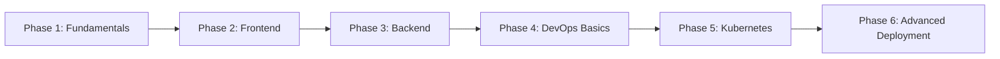
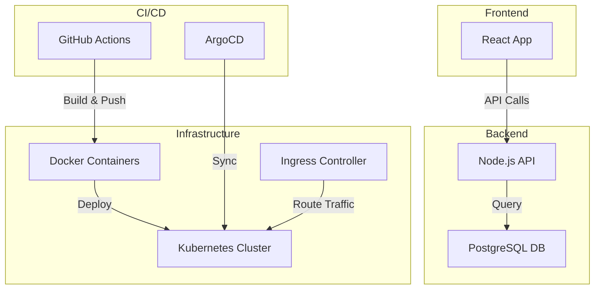

# Full Stack, DevOps & Kubernetes Learning Path

A comprehensive guide to learning full stack development with complete DevOps practices and Kubernetes deployment methods.

---

## 📚 Learning Path Overview

This guide is structured in 6 main phases, progressing from fundamentals to advanced deployment strategies.



---

## Phase 1: Foundation & Prerequisites (Week 1-2)

### Programming Basics
- [ ] **JavaScript/TypeScript**
  - Variables, data types, functions
  - ES6+ features (arrow functions, destructuring, async/await)
  - TypeScript basics (types, interfaces, generics)
  
- [ ] **Version Control - Git**
  - Basic commands: `clone`, `add`, `commit`, `push`, `pull`
  - Branching strategies: `git branch`, `git merge`, `git rebase`
  - Pull requests and code reviews
  - `.gitignore` best practices

### Command Line Basics
- [ ] Navigate filesystem (`cd`, `ls`, `pwd`)
- [ ] File operations (`mkdir`, `touch`, `rm`, `cp`, `mv`)
- [ ] Process management (`ps`, `kill`, `top`)
- [ ] Environment variables

---

## Phase 2: Frontend Development (Week 3-5)

### HTML & CSS
- [ ] **HTML5 Semantics**
  - Semantic tags (`header`, `nav`, `main`, `article`, `footer`)
  - Forms and validation
  - Accessibility basics (ARIA labels, semantic structure)

- [ ] **CSS & Styling**
  - Box model, flexbox, grid
  - Responsive design (media queries)
  - CSS Variables
  - Modern CSS (animations, transitions)

### JavaScript Framework - React
- [ ] **React Basics**
  - Components (functional vs class)
  - JSX syntax
  - Props and state
  - Hooks (`useState`, `useEffect`, `useContext`, `useCallback`, `useMemo`)
  
- [ ] **Advanced React**
  - Custom hooks
  - Context API for state management
  - React Router for navigation
  - Form handling and validation

### Build Tools
- [ ] **npm/yarn** - Package management
- [ ] **Vite/Webpack** - Module bundlers
- [ ] **ESLint/Prettier** - Code quality tools

### Mini Project
> [!TIP]
> Build a Todo App with React that includes:
> - CRUD operations
> - Local storage persistence
> - Responsive design
> - Form validation

---

## Phase 3: Backend Development (Week 6-8)

### Choose a Backend Stack

#### Option A: Node.js/Express
- [ ] **Node.js Basics**
  - Event loop and async programming
  - File system operations
  - Built-in modules (`http`, `fs`, `path`)

- [ ] **Express.js Framework**
  - Routing and middleware
  - Request/response handling
  - Error handling
  - RESTful API design

#### Option B: Python/Flask or Django
- [ ] Python fundamentals
- [ ] Flask/Django framework basics
- [ ] RESTful API development

### Database
- [ ] **Relational - PostgreSQL**
  - SQL basics (SELECT, INSERT, UPDATE, DELETE)
  - Joins, indexes, transactions
  - Database design and normalization
  
- [ ] **NoSQL - MongoDB**
  - Document-based storage
  - CRUD operations
  - Aggregation pipeline

### API Development
- [ ] RESTful API principles
- [ ] Authentication & Authorization (JWT, OAuth)
- [ ] API versioning
- [ ] Request validation
- [ ] Error handling and logging

### Mini Project
> [!TIP]
> Build a Blog API with:
> - User authentication (register/login)
> - CRUD operations for posts
> - Database integration
> - Input validation
> - Error handling

---

## Phase 4: DevOps Fundamentals (Week 9-11)

### Docker Basics
- [ ] **Understanding Containers**
  - What are containers?
  - Containers vs Virtual Machines
  - Docker architecture

- [ ] **Docker Commands**
  ```bash
  # Image management
  docker pull <image>
  docker build -t <name> .
  docker images
  docker rmi <image>
  
  # Container management
  docker run -d -p 8080:80 <image>
  docker ps
  docker stop <container>
  docker rm <container>
  docker exec -it <container> /bin/bash
  
  # System
  docker system prune
  docker logs <container>
  ```

- [ ] **Dockerfile**
  - Base images (`FROM`)
  - Working directory (`WORKDIR`)
  - Copying files (`COPY`, `ADD`)
  - Running commands (`RUN`, `CMD`, `ENTRYPOINT`)
  - Environment variables (`ENV`)
  - Multi-stage builds

  Example Dockerfile:
  ```dockerfile
  FROM node:18-alpine AS build
  WORKDIR /app
  COPY package*.json ./
  RUN npm ci
  COPY . .
  RUN npm run build
  
  FROM node:18-alpine
  WORKDIR /app
  COPY --from=build /app/dist ./dist
  COPY package*.json ./
  RUN npm ci --only=production
  EXPOSE 3000
  CMD ["node", "dist/index.js"]
  ```

- [ ] **Docker Compose**
  - Multi-container applications
  - Service definitions
  - Networks and volumes
  - Environment files

  Example docker-compose.yml:
  ```yaml
  version: '3.8'
  services:
    frontend:
      build: ./frontend
      ports:
        - "3000:3000"
      depends_on:
        - backend
    
    backend:
      build: ./backend
      ports:
        - "8080:8080"
      environment:
        - DATABASE_URL=postgresql://db:5432/mydb
      depends_on:
        - db
    
    db:
      image: postgres:15-alpine
      environment:
        - POSTGRES_DB=mydb
        - POSTGRES_PASSWORD=secret
      volumes:
        - db-data:/var/lib/postgresql/data
  
  volumes:
    db-data:
  ```

### CI/CD Pipeline
- [ ] **GitHub Actions** (or GitLab CI, Jenkins)
  - Workflow syntax
  - Triggers (push, pull_request)
  - Jobs and steps
  - Secrets management
  - Artifacts

  Example workflow:
  ```yaml
  name: CI/CD Pipeline
  
  on:
    push:
      branches: [main]
    pull_request:
      branches: [main]
  
  jobs:
    build:
      runs-on: ubuntu-latest
      steps:
        - uses: actions/checkout@v3
        
        - name: Setup Node.js
          uses: actions/setup-node@v3
          with:
            node-version: '18'
        
        - name: Install dependencies
          run: npm ci
        
        - name: Run tests
          run: npm test
        
        - name: Build
          run: npm run build
        
        - name: Build Docker image
          run: docker build -t myapp:${{ github.sha }} .
  ```

### Infrastructure as Code (IaC)
- [ ] **Basic concepts**
  - Declarative vs imperative
  - Idempotency
  - Version control for infrastructure

---

## Phase 5: Kubernetes Deep Dive (Week 12-16)

### Kubernetes Architecture
- [ ] **Core Components**
  ```mermaid
  graph TB
    subgraph "Control Plane"
      A[API Server]
      B[Scheduler]
      C[Controller Manager]
      D[etcd]
    end
    
    subgraph "Worker Node"
      E[Kubelet]
      F[Kube-proxy]
      G[Container Runtime]
      H[Pods]
    end
    
    A --> E
    B --> E
    C --> E
  ```
  
  - **Control Plane**: API Server, Scheduler, Controller Manager, etcd
  - **Worker Nodes**: Kubelet, Kube-proxy, Container Runtime
  - **Add-ons**: DNS, Dashboard, Monitoring

### Setting Up Kubernetes
- [ ] **Local Development**
  - Minikube installation
  - Kind (Kubernetes in Docker)
  - Docker Desktop Kubernetes
  
  ```bash
  # Minikube
  minikube start
  minikube status
  minikube dashboard
  
  # kubectl basics
  kubectl version
  kubectl cluster-info
  kubectl get nodes
  ```

### Core Kubernetes Resources

#### Pods
The smallest deployable unit in Kubernetes.

```yaml
apiVersion: v1
kind: Pod
metadata:
  name: my-app-pod
  labels:
    app: my-app
spec:
  containers:
  - name: app-container
    image: my-app:1.0
    ports:
    - containerPort: 8080
    env:
    - name: ENV
      value: "production"
    resources:
      requests:
        memory: "64Mi"
        cpu: "250m"
      limits:
        memory: "128Mi"
        cpu: "500m"
```

#### Deployments
Manages replica sets and provides declarative updates.

```yaml
apiVersion: apps/v1
kind: Deployment
metadata:
  name: my-app-deployment
spec:
  replicas: 3
  selector:
    matchLabels:
      app: my-app
  template:
    metadata:
      labels:
        app: my-app
    spec:
      containers:
      - name: my-app
        image: my-app:1.0
        ports:
        - containerPort: 8080
        livenessProbe:
          httpGet:
            path: /health
            port: 8080
          initialDelaySeconds: 30
          periodSeconds: 10
        readinessProbe:
          httpGet:
            path: /ready
            port: 8080
          initialDelaySeconds: 5
          periodSeconds: 5
```

#### Services
Exposes pods to network traffic.

```yaml
# ClusterIP (internal only)
apiVersion: v1
kind: Service
metadata:
  name: my-app-service
spec:
  type: ClusterIP
  selector:
    app: my-app
  ports:
  - port: 80
    targetPort: 8080

---
# LoadBalancer (external)
apiVersion: v1
kind: Service
metadata:
  name: my-app-lb
spec:
  type: LoadBalancer
  selector:
    app: my-app
  ports:
  - port: 80
    targetPort: 8080

---
# NodePort (external on specific port)
apiVersion: v1
kind: Service
metadata:
  name: my-app-nodeport
spec:
  type: NodePort
  selector:
    app: my-app
  ports:
  - port: 80
    targetPort: 8080
    nodePort: 30080
```

#### ConfigMaps & Secrets
Configuration and sensitive data management.

```yaml
# ConfigMap
apiVersion: v1
kind: ConfigMap
metadata:
  name: app-config
data:
  app.properties: |
    color=blue
    mode=production
  database_url: "postgres://db:5432"

---
# Secret
apiVersion: v1
kind: Secret
metadata:
  name: app-secrets
type: Opaque
data:
  password: cGFzc3dvcmQxMjM=  # base64 encoded
  api-key: YXBpa2V5MTIz

---
# Using in Pod
apiVersion: v1
kind: Pod
metadata:
  name: my-app
spec:
  containers:
  - name: app
    image: my-app:1.0
    envFrom:
    - configMapRef:
        name: app-config
    env:
    - name: DB_PASSWORD
      valueFrom:
        secretKeyRef:
          name: app-secrets
          key: password
```

#### Persistent Volumes
Storage management.

```yaml
# Persistent Volume
apiVersion: v1
kind: PersistentVolume
metadata:
  name: my-pv
spec:
  capacity:
    storage: 10Gi
  accessModes:
    - ReadWriteOnce
  persistentVolumeReclaimPolicy: Retain
  storageClassName: standard
  hostPath:
    path: "/mnt/data"

---
# Persistent Volume Claim
apiVersion: v1
kind: PersistentVolumeClaim
metadata:
  name: my-pvc
spec:
  accessModes:
    - ReadWriteOnce
  resources:
    requests:
      storage: 5Gi
  storageClassName: standard

---
# Using in Pod
apiVersion: v1
kind: Pod
metadata:
  name: my-app
spec:
  containers:
  - name: app
    image: my-app:1.0
    volumeMounts:
    - mountPath: "/data"
      name: storage
  volumes:
  - name: storage
    persistentVolumeClaim:
      claimName: my-pvc
```

#### Ingress
HTTP/HTTPS routing to services.

```yaml
apiVersion: networking.k8s.io/v1
kind: Ingress
metadata:
  name: my-ingress
  annotations:
    nginx.ingress.kubernetes.io/rewrite-target: /
spec:
  rules:
  - host: myapp.example.com
    http:
      paths:
      - path: /
        pathType: Prefix
        backend:
          service:
            name: frontend-service
            port:
              number: 80
      - path: /api
        pathType: Prefix
        backend:
          service:
            name: backend-service
            port:
              number: 8080
  tls:
  - hosts:
    - myapp.example.com
    secretName: tls-secret
```

### Kubernetes Commands Cheat Sheet

```bash
# Cluster Management
kubectl cluster-info
kubectl get nodes
kubectl describe node <node-name>

# Pods
kubectl get pods
kubectl get pods -o wide
kubectl describe pod <pod-name>
kubectl logs <pod-name>
kubectl logs <pod-name> -f  # Follow logs
kubectl exec -it <pod-name> -- /bin/bash

# Deployments
kubectl create deployment <name> --image=<image>
kubectl get deployments
kubectl describe deployment <name>
kubectl scale deployment <name> --replicas=5
kubectl rollout status deployment <name>
kubectl rollout history deployment <name>
kubectl rollout undo deployment <name>

# Services
kubectl get services
kubectl describe service <name>
kubectl expose deployment <name> --type=LoadBalancer --port=80

# ConfigMaps & Secrets
kubectl create configmap <name> --from-file=<path>
kubectl create secret generic <name> --from-literal=password=secret
kubectl get configmaps
kubectl get secrets

# Apply configurations
kubectl apply -f <file.yaml>
kubectl apply -f <directory>/
kubectl delete -f <file.yaml>

# Namespaces
kubectl get namespaces
kubectl create namespace <name>
kubectl get pods -n <namespace>
kubectl config set-context --current --namespace=<name>

# Debugging
kubectl get events
kubectl top nodes
kubectl top pods
kubectl port-forward <pod-name> 8080:80
```

### Helm - Package Manager for Kubernetes
- [ ] **Helm Basics**
  ```bash
  # Add repository
  helm repo add bitnami https://charts.bitnami.com/bitnami
  helm repo update
  
  # Search charts
  helm search repo <keyword>
  
  # Install chart
  helm install my-release bitnami/nginx
  
  # List releases
  helm list
  
  # Upgrade release
  helm upgrade my-release bitnami/nginx --set service.type=LoadBalancer
  
  # Uninstall
  helm uninstall my-release
  ```

- [ ] **Creating Custom Charts**
  ```bash
  # Create new chart
  helm create my-chart
  
  # Chart structure:
  # my-chart/
  #   Chart.yaml          # Chart metadata
  #   values.yaml         # Default values
  #   templates/          # Kubernetes manifests
  #   charts/             # Dependent charts
  
  # Install local chart
  helm install my-app ./my-chart
  
  # Template with values
  helm template my-app ./my-chart --values custom-values.yaml
  ```

---

## Phase 6: Advanced Deployment Strategies (Week 17-20)

### Deployment Patterns

#### 1. Rolling Update (Default)
Gradually replaces old pods with new ones.

```yaml
apiVersion: apps/v1
kind: Deployment
metadata:
  name: rolling-deployment
spec:
  replicas: 4
  strategy:
    type: RollingUpdate
    rollingUpdate:
      maxSurge: 1        # Max pods above desired count
      maxUnavailable: 1  # Max pods unavailable during update
  template:
    metadata:
      labels:
        app: my-app
        version: v2
    spec:
      containers:
      - name: app
        image: my-app:v2
```

> [!NOTE]
> **Pros**: Zero downtime, gradual rollout
> **Cons**: Both versions run simultaneously, slower rollout

#### 2. Blue-Green Deployment
Run two identical environments, switch traffic instantly.

```yaml
# Blue deployment (current)
apiVersion: apps/v1
kind: Deployment
metadata:
  name: my-app-blue
spec:
  replicas: 3
  selector:
    matchLabels:
      app: my-app
      version: blue
  template:
    metadata:
      labels:
        app: my-app
        version: blue
    spec:
      containers:
      - name: app
        image: my-app:1.0

---
# Green deployment (new)
apiVersion: apps/v1
kind: Deployment
metadata:
  name: my-app-green
spec:
  replicas: 3
  selector:
    matchLabels:
      app: my-app
      version: green
  template:
    metadata:
      labels:
        app: my-app
        version: green
    spec:
      containers:
      - name: app
        image: my-app:2.0

---
# Service (switch by updating selector)
apiVersion: v1
kind: Service
metadata:
  name: my-app-service
spec:
  selector:
    app: my-app
    version: blue  # Change to 'green' to switch
  ports:
  - port: 80
    targetPort: 8080
```

> [!NOTE]
> **Pros**: Instant rollback, testing in production environment
> **Cons**: Requires 2x resources, database migration challenges

#### 3. Canary Deployment
Gradually shift traffic to new version.

```yaml
# Stable version
apiVersion: apps/v1
kind: Deployment
metadata:
  name: my-app-stable
spec:
  replicas: 9
  selector:
    matchLabels:
      app: my-app
      version: stable
  template:
    metadata:
      labels:
        app: my-app
        version: stable
    spec:
      containers:
      - name: app
        image: my-app:1.0

---
# Canary version
apiVersion: apps/v1
kind: Deployment
metadata:
  name: my-app-canary
spec:
  replicas: 1  # 10% traffic
  selector:
    matchLabels:
      app: my-app
      version: canary
  template:
    metadata:
      labels:
        app: my-app
        version: canary
    spec:
      containers:
      - name: app
        image: my-app:2.0

---
# Service (routes to both)
apiVersion: v1
kind: Service
metadata:
  name: my-app-service
spec:
  selector:
    app: my-app  # Matches both versions
  ports:
  - port: 80
    targetPort: 8080
```

> [!NOTE]
> **Pros**: Risk mitigation, gradual rollout, real user testing
> **Cons**: Complex monitoring, longer deployment time

### Advanced Tools

#### GitOps with ArgoCD
Declarative continuous deployment.

```yaml
apiVersion: argoproj.io/v1alpha1
kind: Application
metadata:
  name: my-app
  namespace: argocd
spec:
  project: default
  source:
    repoURL: https://github.com/user/repo
    targetRevision: HEAD
    path: k8s
  destination:
    server: https://kubernetes.default.svc
    namespace: production
  syncPolicy:
    automated:
      prune: true
      selfHeal: true
```

#### Service Mesh with Istio
Advanced traffic management, security, observability.

```yaml
# Virtual Service for traffic splitting
apiVersion: networking.istio.io/v1alpha3
kind: VirtualService
metadata:
  name: my-app
spec:
  hosts:
  - my-app.example.com
  http:
  - match:
    - headers:
        user-agent:
          regex: ".*iPhone.*"
    route:
    - destination:
        host: my-app-mobile
  - route:
    - destination:
        host: my-app-v1
      weight: 90
    - destination:
        host: my-app-v2
      weight: 10
```

### Monitoring & Observability

#### Prometheus & Grafana
```yaml
# ServiceMonitor for Prometheus
apiVersion: monitoring.coreos.com/v1
kind: ServiceMonitor
metadata:
  name: my-app-metrics
spec:
  selector:
    matchLabels:
      app: my-app
  endpoints:
  - port: metrics
    interval: 30s
```

#### Logging with ELK/EFK Stack
- **Elasticsearch**: Store logs
- **Fluentd/Filebeat**: Collect logs
- **Kibana**: Visualize logs

---

## Cloud Platform Deployment

### AWS EKS (Elastic Kubernetes Service)
```bash
# Install eksctl
brew install eksctl  # macOS
choco install eksctl  # Windows

# Create cluster
eksctl create cluster \
  --name my-cluster \
  --region us-west-2 \
  --nodegroup-name standard-workers \
  --node-type t3.medium \
  --nodes 3 \
  --nodes-min 1 \
  --nodes-max 4

# Update kubeconfig
aws eks update-kubeconfig --name my-cluster --region us-west-2

# Deploy application
kubectl apply -f deployment.yaml
```

### Google GKE (Google Kubernetes Engine)
```bash
# Create cluster
gcloud container clusters create my-cluster \
  --num-nodes=3 \
  --zone=us-central1-a

# Get credentials
gcloud container clusters get-credentials my-cluster --zone=us-central1-a

# Deploy application
kubectl apply -f deployment.yaml
```

### Azure AKS (Azure Kubernetes Service)
```bash
# Create resource group
az group create --name myResourceGroup --location eastus

# Create cluster
az aks create \
  --resource-group myResourceGroup \
  --name myAKSCluster \
  --node-count 3 \
  --enable-addons monitoring

# Get credentials
az aks get-credentials --resource-group myResourceGroup --name myAKSCluster

# Deploy application
kubectl apply -f deployment.yaml
```

---

## Complete Full Stack Project Example

Let's build a **Task Management Application** with full DevOps pipeline.

### Architecture


### Project Structure
```
task-manager/
├── frontend/
│   ├── src/
│   ├── package.json
│   ├── Dockerfile
│   └── nginx.conf
├── backend/
│   ├── src/
│   ├── package.json
│   └── Dockerfile
├── k8s/
│   ├── namespace.yaml
│   ├── frontend-deployment.yaml
│   ├── backend-deployment.yaml
│   ├── postgres-statefulset.yaml
│   ├── services.yaml
│   ├── ingress.yaml
│   └── secrets.yaml
├── .github/
│   └── workflows/
│       └── ci-cd.yaml
└── docker-compose.yaml
```

### Implementation Steps

1. **Develop Frontend & Backend**
2. **Containerize with Docker**
3. **Local testing with Docker Compose**
4. **Create Kubernetes manifests**
5. **Setup CI/CD pipeline**
6. **Deploy to cloud**
7. **Setup monitoring**

---

## Learning Resources

### Official Documentation
- [Kubernetes Docs](https://kubernetes.io/docs/)
- [Docker Docs](https://docs.docker.com/)
- [React Docs](https://react.dev/)
- [Node.js Docs](https://nodejs.org/docs/)

### Interactive Learning
- [Kubernetes by Example](https://kubernetesbyexample.com/)
- [Play with Kubernetes](https://labs.play-with-k8s.com/)
- [Katacoda Scenarios](https://www.katacoda.com/)
- [freeCodeCamp](https://www.freecodecamp.org/)

### Video Courses
- Kubernetes for Beginners (YouTube)
- Full Stack Open (University of Helsinki)
- Docker Mastery (Udemy)

### Books
- "Kubernetes in Action" by Marko Lukša
- "The DevOps Handbook" by Gene Kim
- "Continuous Delivery" by Jez Humble

---

## Practice Projects

### Beginner
- [ ] Todo app with React + Node.js
- [ ] Dockerize a simple web app
- [ ] Deploy static site to Kubernetes

### Intermediate
- [ ] Blog platform with authentication
- [ ] Multi-service app with Docker Compose
- [ ] CI/CD pipeline with GitHub Actions

### Advanced
- [ ] Microservices architecture
- [ ] Blue-green deployment implementation
- [ ] Service mesh with Istio
- [ ] Multi-cluster deployment

---

## Certification Paths

### Kubernetes Certifications
- **CKA** (Certified Kubernetes Administrator)
- **CKAD** (Certified Kubernetes Application Developer)
- **CKS** (Certified Kubernetes Security Specialist)

### Cloud Certifications
- **AWS**: Solutions Architect, DevOps Engineer
- **Azure**: Administrator, DevOps Engineer
- **GCP**: Cloud Engineer, Cloud Architect

---

## Next Steps Checklist

- [ ] Set up development environment (Node.js, Docker, kubectl)
- [ ] Complete Phase 1-2 (Frontend basics)
- [ ] Build your first full stack app
- [ ] Learn Docker and containerization
- [ ] Set up local Kubernetes cluster (Minikube)
- [ ] Deploy your app to Kubernetes
- [ ] Implement CI/CD pipeline
- [ ] Explore cloud platforms (AWS/GCP/Azure)
- [ ] Study advanced deployment strategies
- [ ] Build a portfolio project showcasing all skills

---

> [!IMPORTANT]
> **Learning Timeline**: This comprehensive path takes approximately 4-5 months with consistent daily practice (2-3 hours/day). Adjust based on your schedule and prior experience.

> [!TIP]
> **Best Practice**: Build projects alongside learning. Apply each concept immediately in a real project for better retention and practical understanding.

Good luck on your learning journey! 🚀
