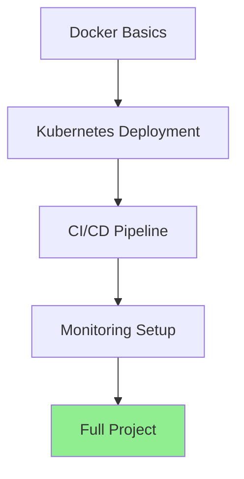

# DevOps Hands-On Practice Exercises
## Real-World Projects for Interview Preparation

---

## 🎯 Practice Exercise Roadmap



---

## Exercise 1: Docker Containerization

### Task 1.1: Containerize a Node.js Application

**Objective**: Build an optimized Docker image for a Node.js app

**Application Code** (`app.js`):
```javascript
const express = require('express');
const app = express();
const port = process.env.PORT || 3000;

app.get('/health', (req, res) => {
  res.json({ status: 'healthy', timestamp: new Date() });
});

app.get('/', (req, res) => {
  res.json({ message: 'Hello from DevOps!' });
});

app.listen(port, () => {
  console.log(`Server running on port ${port}`);
});
```

**Your Tasks**:
1. ✅ Create a production-ready Dockerfile with multi-stage build
2. ✅ Image size should be < 150MB
3. ✅ Run as non-root user
4. ✅ Include health check
5. ✅ Use build arguments for environment

**Solution**:
```dockerfile
# Build stage
FROM node:18-alpine AS builder
WORKDIR /app
COPY package*.json ./
RUN npm ci --only=production

# Production stage
FROM node:18-alpine
WORKDIR /app

# Create non-root user
RUN addgroup -g 1001 nodejs && \
    adduser -S nodejs -u 1001

# Copy from builder
COPY --from=builder --chown=nodejs:nodejs /app/node_modules ./node_modules
COPY --chown=nodejs:nodejs . .

USER nodejs

EXPOSE 3000

HEALTHCHECK --interval=30s --timeout=3s --start-period=5s \
  CMD node -e "require('http').get('http://localhost:3000/health', (r) => process.exit(r.statusCode === 200 ? 0 : 1))"

CMD ["node", "app.js"]
```

**Build & Run**:
```bash
docker build -t myapp:v1 .
docker images myapp:v1  # Check size
docker run -d -p 3000:3000 --name myapp myapp:v1
docker logs -f myapp
curl http://localhost:3000/health
```

---

### Task 1.2: Docker Compose Full Stack

**Objective**: Create a multi-container application with frontend, backend, and database

**Requirements**:
- React frontend (port 3000)
- Node.js backend API (port 8080)
- PostgreSQL database (port 5432)
- Redis cache (port 6379)
- All services in custom network
- Health checks for all services
- Volume persistence for database

**Solution** (`docker-compose.yml`):
```yaml
version: '3.8'

services:
  frontend:
    build:
      context: ./frontend
      dockerfile: Dockerfile
    ports:
      - "3000:80"
    environment:
      - REACT_APP_API_URL=http://localhost:8080
    depends_on:
      backend:
        condition: service_healthy
    networks:
      - app-network

  backend:
    build:
      context: ./backend
      dockerfile: Dockerfile
    ports:
      - "8080:8080"
    environment:
      - NODE_ENV=production
      - DB_HOST=postgres
      - DB_PORT=5432
      - DB_NAME=myapp
      - DB_USER=postgres
      - DB_PASSWORD=${DB_PASSWORD:-secret123}
      - REDIS_HOST=redis
      - REDIS_PORT=6379
    depends_on:
      postgres:
        condition: service_healthy
      redis:
        condition: service_started
    healthcheck:
      test: ["CMD", "curl", "-f", "http://localhost:8080/health"]
      interval: 10s
      timeout: 5s
      retries: 3
      start_period: 10s
    networks:
      - app-network

  postgres:
    image: postgres:15-alpine
    environment:
      - POSTGRES_DB=myapp
      - POSTGRES_USER=postgres
      - POSTGRES_PASSWORD=${DB_PASSWORD:-secret123}
    volumes:
      - postgres-data:/var/lib/postgresql/data
      - ./init.sql:/docker-entrypoint-initdb.d/init.sql
    ports:
      - "5432:5432"
    healthcheck:
      test: ["CMD-SHELL", "pg_isready -U postgres"]
      interval: 10s
      timeout: 5s
      retries: 5
    networks:
      - app-network

  redis:
    image: redis:7-alpine
    ports:
      - "6379:6379"
    command: redis-server --appendonly yes
    volumes:
      - redis-data:/data
    networks:
      - app-network

volumes:
  postgres-data:
  redis-data:

networks:
  app-network:
    driver: bridge
```

**Commands to Practice**:
```bash
# Start all services
docker-compose up -d

# View logs
docker-compose logs -f backend

# Check service health
docker-compose ps

# Scale backend
docker-compose up -d --scale backend=3

# Stop and remove
docker-compose down -v
```

---

## Exercise 2: Kubernetes Deployment

### Task 2.1: Deploy Microservices to Kubernetes

**Objective**: Deploy a complete microservices app to Kubernetes

**Architecture**:
- Frontend deployment (3 replicas)
- Backend API deployment (3 replicas)
- PostgreSQL StatefulSet (1 replica)
- Redis deployment (1 replica)
- Services for all components
- Ingress for external access
- ConfigMaps and Secrets
- Persistent volumes

**Step 1: Namespace**
```yaml
# namespace.yaml
apiVersion: v1
kind: Namespace
metadata:
  name: myapp
  labels:
    name: myapp
```

**Step 2: ConfigMap & Secret**
```yaml
# config.yaml
apiVersion: v1
kind: ConfigMap
metadata:
  name: app-config
  namespace: myapp
data:
  APP_ENV: "production"
  LOG_LEVEL: "info"
  API_URL: "http://backend-service:8080"

---
apiVersion: v1
kind: Secret
metadata:
  name: app-secrets
  namespace: myapp
type: Opaque
data:
  # echo -n 'mypassword123' | base64
  db-password: bXlwYXNzd29yZDEyMw==
  redis-password: cmVkaXNwYXNzMTIz
```

**Step 3: PostgreSQL StatefulSet**
```yaml
# postgres-statefulset.yaml
apiVersion: v1
kind: Service
metadata:
  name: postgres-service
  namespace: myapp
spec:
  selector:
    app: postgres
  ports:
  - port: 5432
    targetPort: 5432
  clusterIP: None  # Headless service

---
apiVersion: apps/v1
kind: StatefulSet
metadata:
  name: postgres
  namespace: myapp
spec:
  serviceName: postgres-service
  replicas: 1
  selector:
    matchLabels:
      app: postgres
  template:
    metadata:
      labels:
        app: postgres
    spec:
      containers:
      - name: postgres
        image: postgres:15-alpine
        ports:
        - containerPort: 5432
        env:
        - name: POSTGRES_DB
          value: myapp
        - name: POSTGRES_PASSWORD
          valueFrom:
            secretKeyRef:
              name: app-secrets
              key: db-password
        volumeMounts:
        - name: postgres-storage
          mountPath: /var/lib/postgresql/data
        resources:
          requests:
            memory: "256Mi"
            cpu: "250m"
          limits:
            memory: "512Mi"
            cpu: "500m"
  volumeClaimTemplates:
  - metadata:
      name: postgres-storage
    spec:
      accessModes: ["ReadWriteOnce"]
      resources:
        requests:
          storage: 5Gi
```

**Step 4: Backend Deployment**
```yaml
# backend-deployment.yaml
apiVersion: apps/v1
kind: Deployment
metadata:
  name: backend
  namespace: myapp
spec:
  replicas: 3
  strategy:
    type: RollingUpdate
    rollingUpdate:
      maxSurge: 1
      maxUnavailable: 0
  selector:
    matchLabels:
      app: backend
  template:
    metadata:
      labels:
        app: backend
        version: v1
    spec:
      containers:
      - name: backend
        image: your-registry/backend:v1
        ports:
        - containerPort: 8080
        env:
        - name: NODE_ENV
          value: production
        - name: DB_HOST
          value: postgres-service
        - name: DB_PASSWORD
          valueFrom:
            secretKeyRef:
              name: app-secrets
              key: db-password
        envFrom:
        - configMapRef:
            name: app-config
        resources:
          requests:
            memory: "128Mi"
            cpu: "100m"
          limits:
            memory: "256Mi"
            cpu: "200m"
        livenessProbe:
          httpGet:
            path: /health
            port: 8080
          initialDelaySeconds: 30
          periodSeconds: 10
          timeoutSeconds: 5
          failureThreshold: 3
        readinessProbe:
          httpGet:
            path: /ready
            port: 8080
          initialDelaySeconds: 5
          periodSeconds: 5
          timeoutSeconds: 3
          failureThreshold: 3

---
apiVersion: v1
kind: Service
metadata:
  name: backend-service
  namespace: myapp
spec:
  type: ClusterIP
  selector:
    app: backend
  ports:
  - port: 8080
    targetPort: 8080
```

**Step 5: Frontend Deployment**
```yaml
# frontend-deployment.yaml
apiVersion: apps/v1
kind: Deployment
metadata:
  name: frontend
  namespace: myapp
spec:
  replicas: 3
  selector:
    matchLabels:
      app: frontend
  template:
    metadata:
      labels:
        app: frontend
    spec:
      containers:
      - name: frontend
        image: your-registry/frontend:v1
        ports:
        - containerPort: 80
        resources:
          requests:
            memory: "64Mi"
            cpu: "50m"
          limits:
            memory: "128Mi"
            cpu: "100m"

---
apiVersion: v1
kind: Service
metadata:
  name: frontend-service
  namespace: myapp
spec:
  type: LoadBalancer
  selector:
    app: frontend
  ports:
  - port: 80
    targetPort: 80
```

**Step 6: Ingress**
```yaml
# ingress.yaml
apiVersion: networking.k8s.io/v1
kind: Ingress
metadata:
  name: app-ingress
  namespace: myapp
  annotations:
    nginx.ingress.kubernetes.io/rewrite-target: /
    cert-manager.io/cluster-issuer: "letsencrypt-prod"
spec:
  ingressClassName: nginx
  tls:
  - hosts:
    - myapp.example.com
    secretName: myapp-tls
  rules:
  - host: myapp.example.com
    http:
      paths:
      - path: /api
        pathType: Prefix
        backend:
          service:
            name: backend-service
            port:
              number: 8080
      - path: /
        pathType: Prefix
        backend:
          service:
            name: frontend-service
            port:
              number: 80
```

**Deployment Commands**:
```bash
# Create namespace
kubectl apply -f namespace.yaml

# Apply configurations
kubectl apply -f config.yaml
kubectl apply -f postgres-statefulset.yaml
kubectl apply -f backend-deployment.yaml
kubectl apply -f frontend-deployment.yaml
kubectl apply -f ingress.yaml

# Verify deployment
kubectl get all -n myapp
kubectl get pvc -n myapp
kubectl describe ingress app-ingress -n myapp

# Check pod logs
kubectl logs -f deployment/backend -n myapp

# Scale deployment
kubectl scale deployment backend --replicas=5 -n myapp

# Rolling update
kubectl set image deployment/backend backend=your-registry/backend:v2 -n myapp
kubectl rollout status deployment/backend -n myapp
kubectl rollout history deployment/backend -n myapp
kubectl rollout undo deployment/backend -n myapp
```

---

### Task 2.2: Implement Blue-Green Deployment

**Objective**: Practice zero-downtime deployment strategy

**Blue Deployment** (Current):
```yaml
apiVersion: apps/v1
kind: Deployment
metadata:
  name: myapp-blue
  namespace: myapp
spec:
  replicas: 3
  selector:
    matchLabels:
      app: myapp
      version: blue
  template:
    metadata:
      labels:
        app: myapp
        version: blue
    spec:
      containers:
      - name: app
        image: myapp:1.0
        ports:
        - containerPort: 8080
```

**Green Deployment** (New):
```yaml
apiVersion: apps/v1
kind: Deployment
metadata:
  name: myapp-green
  namespace: myapp
spec:
  replicas: 3
  selector:
    matchLabels:
      app: myapp
      version: green
  template:
    metadata:
      labels:
        app: myapp
        version: green
    spec:
      containers:
      - name: app
        image: myapp:2.0
        ports:
        - containerPort: 8080
```

**Service** (Traffic Control):
```yaml
apiVersion: v1
kind: Service
metadata:
  name: myapp-service
  namespace: myapp
spec:
  selector:
    app: myapp
    version: blue  # Change to 'green' to switch
  ports:
  - port: 80
    targetPort: 8080
```

**Practice Steps**:
```bash
# 1. Deploy blue version
kubectl apply -f blue-deployment.yaml

# 2. Deploy green version (new)
kubectl apply -f green-deployment.yaml

# 3. Test green version internally
kubectl port-forward deployment/myapp-green 9090:8080
curl http://localhost:9090/health

# 4. Switch traffic to green
kubectl patch service myapp-service -p '{"spec":{"selector":{"version":"green"}}}'

# 5. Monitor
kubectl get pods -l app=myapp -w

# 6. Rollback if needed
kubectl patch service myapp-service -p '{"spec":{"selector":{"version":"blue"}}}'

# 7. Delete blue after verification
kubectl delete deployment myapp-blue
```

---

## Exercise 3: CI/CD Pipeline

### Task 3.1: Complete GitHub Actions CI/CD

**Objective**: Build a full CI/CD pipeline that tests, builds, and deploys to Kubernetes

**Project Structure**:
```
project/
├── .github/
│   └── workflows/
│       └── deploy.yml
├── src/
├── tests/
├── Dockerfile
├── k8s/
│   ├── deployment.yaml
│   └── service.yaml
└── package.json
```

**Complete Pipeline** (`.github/workflows/deploy.yml`):
```yaml
name: Complete CI/CD Pipeline

on:
  push:
    branches: [main, develop]
  pull_request:
    branches: [main]

env:
  REGISTRY: ghcr.io
  IMAGE_NAME: ${{ github.repository }}

jobs:
  # Job 1: Code Quality & Testing
  quality:
    runs-on: ubuntu-latest
    steps:
      - name: Checkout code
        uses: actions/checkout@v3

      - name: Setup Node.js
        uses: actions/setup-node@v3
        with:
          node-version: '18'
          cache: 'npm'

      - name: Install dependencies
        run: npm ci

      - name: Lint code
        run: npm run lint

      - name: Run unit tests
        run: npm run test:unit

      - name: Run integration tests
        run: npm run test:integration

      - name: Generate coverage report
        run: npm run test:coverage

      - name: Upload coverage
        uses: codecov/codecov-action@v3
        with:
          files: ./coverage/lcov.info

  # Job 2: Security Scanning
  security:
    runs-on: ubuntu-latest
    steps:
      - uses: actions/checkout@v3

      - name: Run Snyk security scan
        uses: snyk/actions/node@master
        env:
          SNYK_TOKEN: ${{ secrets.SNYK_TOKEN }}

      - name: Run npm audit
        run: npm audit --audit-level=high

  # Job 3: Build & Push Docker Image
  build:
    needs: [quality, security]
    runs-on: ubuntu-latest
    if: github.ref == 'refs/heads/main'
    permissions:
      contents: read
      packages: write
    outputs:
      image-tag: ${{ steps.meta.outputs.tags }}
    
    steps:
      - uses: actions/checkout@v3

      - name: Set up Docker Buildx
        uses: docker/setup-buildx-action@v2

      - name: Log in to Container Registry
        uses: docker/login-action@v2
        with:
          registry: ${{ env.REGISTRY }}
          username: ${{ github.actor }}
          password: ${{ secrets.GITHUB_TOKEN }}

      - name: Extract metadata
        id: meta
        uses: docker/metadata-action@v4
        with:
          images: ${{ env.REGISTRY }}/${{ env.IMAGE_NAME }}
          tags: |
            type=sha,prefix={{branch}}-
            type=ref,event=branch
            type=semver,pattern={{version}}

      - name: Build and push Docker image
        uses: docker/build-push-action@v4
        with:
          context: .
          push: true
          tags: ${{ steps.meta.outputs.tags }}
          labels: ${{ steps.meta.outputs.labels }}
          cache-from: type=gha
          cache-to: type=gha,mode=max

      - name: Scan image for vulnerabilities
        uses: aquasecurity/trivy-action@master
        with:
          image-ref: ${{ steps.meta.outputs.tags }}
          format: 'sarif'
          output: 'trivy-results.sarif'

  # Job 4: Deploy to Kubernetes
  deploy:
    needs: build
    runs-on: ubuntu-latest
    environment:
      name: production
      url: https://myapp.example.com
    
    steps:
      - uses: actions/checkout@v3

      - name: Set up kubectl
        uses: azure/setup-kubectl@v3
        with:
          version: 'v1.28.0'

      - name: Configure kubectl
        run: |
          echo "${{ secrets.KUBECONFIG }}" | base64 -d > kubeconfig
          echo "KUBECONFIG=$(pwd)/kubeconfig" >> $GITHUB_ENV

      - name: Update deployment image
        run: |
          kubectl set image deployment/myapp \
            app=${{ env.REGISTRY }}/${{ env.IMAGE_NAME }}:main-${{ github.sha }} \
            -n production

      - name: Wait for rollout
        run: |
          kubectl rollout status deployment/myapp -n production --timeout=5m

      - name: Verify deployment
        run: |
          kubectl get pods -n production -l app=myapp
          kubectl get service myapp-service -n production

      - name: Run smoke tests
        run: |
          SERVICE_URL=$(kubectl get service myapp-service -n production -o jsonpath='{.status.loadBalancer.ingress[0].ip}')
          curl -f http://$SERVICE_URL/health || exit 1

  # Job 5: Notification
  notify:
    needs: [deploy]
    runs-on: ubuntu-latest
    if: always()
    steps:
      - name: Send Slack notification
        uses: 8398a7/action-slack@v3
        with:
          status: ${{ job.status }}
          text: |
            Deployment ${{ job.status }}
            Commit: ${{ github.sha }}
            Author: ${{ github.actor }}
        env:
          SLACK_WEBHOOK_URL: ${{ secrets.SLACK_WEBHOOK }}
```

**Practice Tasks**:
1. Set up GitHub repository
2. Add secrets (KUBECONFIG, SLACK_WEBHOOK)
3. Trigger pipeline with a commit
4. Monitor pipeline execution
5. Fix any failing tests
6. Verify deployment

---

## Exercise 4: Troubleshooting Scenarios

### Scenario 1: Pod CrashLoopBackOff

**Problem**:
```bash
$ kubectl get pods
NAME                      READY   STATUS             RESTARTS   AGE
myapp-xxx                 0/1     CrashLoopBackOff   5          3m
```

**Debugging Steps**:
```bash
# 1. Check pod description
kubectl describe pod myapp-xxx

# 2. Check logs
kubectl logs myapp-xxx
kubectl logs myapp-xxx --previous

# 3. Check events
kubectl get events --sort-by=.metadata.creationTimestamp

# 4. Check resource constraints
kubectl top pod myapp-xxx

# 5. Exec into pod (if running)
kubectl exec -it myapp-xxx -- sh
```

**Common Causes & Solutions**:
- **Missing environment variables**: Add to ConfigMap/Secret
- **Port already in use**: Check containerPort configuration
- **Health check failing**: Adjust initialDelaySeconds
- **Out of memory**: Increase memory limits
- **Application error**: Check application logs

---

### Scenario 2: Service Not Accessible

**Problem**: Cannot access service externally

**Debugging Checklist**:
```bash
# 1. Check service
kubectl get svc myapp-service
kubectl describe svc myapp-service

# 2. Check endpoints
kubectl get endpoints myapp-service

# 3. Verify pod labels match service selector
kubectl get pods --show-labels
kubectl describe svc myapp-service | grep Selector

# 4. Test from within cluster
kubectl run test-pod --image=busybox -it --rm -- wget -O- http://myapp-service:80

# 5. Check ingress
kubectl get ingress
kubectl describe ingress myapp-ingress

# 6. DNS resolution
kubectl run test-pod --image=busybox -it --rm -- nslookup myapp-service
```

---

### Scenario 3: High CPU Usage

**Problem**: Application pods consuming excessive CPU

**Investigation**:
```bash
# 1. Check current usage
kubectl top pods -n myapp
kubectl top nodes

# 2. Check resource limits
kubectl describe pod myapp-xxx | grep -A 5 "Limits:"

# 3. HPA status
kubectl get hpa
kubectl describe hpa myapp-hpa

# 4. Application profiling
kubectl exec -it myapp-xxx -- top
kubectl exec -it myapp-xxx -- ps aux

# 5. Check for resource-intensive queries
kubectl logs myapp-xxx | grep -i "slow query"
```

**Solutions**:
- Scale horizontally with HPA
- Optimize application code
- Increase resource limits
- Add caching layer (Redis)
- Database query optimization

---

## Exercise 5: Complete Full-Stack Project

### Project: Task Management System with Full DevOps Pipeline

**Tech Stack**:
- Frontend: React
- Backend: Node.js/Express
- Database: PostgreSQL
- Cache: Redis
- Container: Docker
- Orchestration: Kubernetes
- CI/CD: GitHub Actions
- Monitoring: Prometheus + Grafana

**Project Structure**:
```
task-manager/
├── frontend/
│   ├── src/
│   ├── Dockerfile
│   └── package.json
├── backend/
│   ├── src/
│   ├── Dockerfile
│   └── package.json
├── k8s/
│   ├── namespace.yaml
│   ├── configmap.yaml
│   ├── secrets.yaml
│   ├── postgres-statefulset.yaml
│   ├── redis-deployment.yaml
│   ├── backend-deployment.yaml
│   ├── frontend-deployment.yaml
│   ├── services.yaml
│   ├── ingress.yaml
│   └── hpa.yaml
├── monitoring/
│   ├── prometheus-config.yaml
│   └── grafana-dashboard.json
├── .github/
│   └── workflows/
│       └── deploy.yml
└── docker-compose.yml
```

**Implementation Checklist**:

**Phase 1: Development**
- [ ] Create React frontend with CRUD operations
- [ ] Build Express API with authentication
- [ ] Setup PostgreSQL schema
- [ ] Implement Redis caching
- [ ] Write unit and integration tests

**Phase 2: Containerization**
- [ ] Write optimized Dockerfiles
- [ ] Create docker-compose for local dev
- [ ] Test multi-container setup
- [ ] Implement health checks

**Phase 3: Kubernetes Deployment**
- [ ] Create all K8s manifests
- [ ] Setup ConfigMaps and Secrets
- [ ] Configure persistent storage
- [ ] Setup Ingress with TLS
- [ ] Implement HPA for auto-scaling

**Phase 4: CI/CD**
- [ ] Setup GitHub Actions workflow
- [ ] Add automated testing
- [ ] Implement security scanning
- [ ] Configure automatic deployment
- [ ] Setup rollback mechanism

**Phase 5: Monitoring**
- [ ] Deploy Prometheus
- [ ] Setup Grafana dashboards
- [ ] Configure alerting rules
- [ ] Implement logging with ELK
- [ ] Add application metrics

**Phase 6: Security**
- [ ] Implement RBAC
- [ ] Setup network policies
- [ ] Add pod security policies
- [ ] Scan images for vulnerabilities
- [ ] Encrypt secrets at rest

---

## 🎓 Interview Practice Questions

After completing exercises, practice answering:

1. **Explain your CI/CD pipeline setup**
2. **How did you optimize Docker image size?**
3. **Describe your Kubernetes deployment strategy**
4. **How do you handle secrets in Kubernetes?**
5. **Walk me through debugging a CrashLoopBackOff**
6. **How do you ensure zero-downtime deployments?**
7. **Explain your monitoring and alerting setup**
8. **How do you handle database migrations?**
9. **Describe your backup and disaster recovery strategy**
10. **How do you optimize application performance?**

---

## 📝 Practice Tips

> [!TIP]
> **Daily Practice Schedule**:
> - **Week 1**: Docker exercises
> - **Week 2**: Kubernetes basics
> - **Week 3**: CI/CD pipelines
> - **Week 4**: Full project implementation

> [!IMPORTANT]
> **Interview Demo Prep**:
> - Record yourself explaining the project
> - Practice live coding deployment
> - Be ready to troubleshoot on the spot
> - Prepare to discuss design decisions

---

## Resources for Practice

**Local Kubernetes**:
- Minikube: `minikube start`
- Kind: `kind create cluster`
- Docker Desktop: Enable Kubernetes

**Cloud Free Tier**:
- GCP: $300 credit
- AWS: Free tier EKS
- Azure: $200 credit

**Practice Platforms**:
- Katacoda scenarios
- Play with Kubernetes
- KillerCoda

Good luck with your hands-on practice! 🚀
