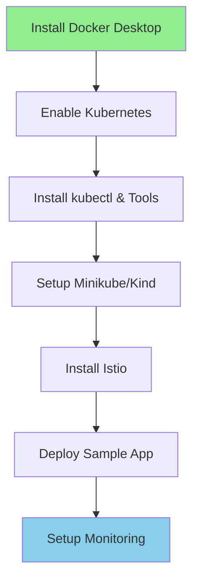

# Local DevOps Environment Setup Guide
## Complete Setup for Windows - Practice All DevOps Skills

---

## 📋 Setup Overview



---

## Step 1: Install Docker Desktop

### Download & Install

1. **Download Docker Desktop for Windows**
   - Visit: https://www.docker.com/products/docker-desktop
   - Download Windows installer
   - Requires Windows 10/11 Pro, Enterprise, or Education

2. **Install Docker Desktop**
   ```powershell
   # Run as Administrator
   # Double-click Docker Desktop Installer.exe
   # Follow installation wizard
   # Restart computer when prompted
   ```

3. **Enable WSL 2 Backend** (Recommended)
   ```powershell
   # Install WSL 2
   wsl --install
   
   # Set WSL 2 as default
   wsl --set-default-version 2
   
   # Install Ubuntu (optional but recommended)
   wsl --install -d Ubuntu-22.04
   ```

4. **Configure Docker Desktop**
   - Open Docker Desktop
   - Go to Settings → Resources
   - Allocate resources:
     - **CPU**: 4 cores minimum (6-8 recommended)
     - **Memory**: 8 GB minimum (12-16 GB recommended)
     - **Disk**: 60 GB minimum

5. **Verify Installation**
   ```powershell
   # Check Docker version
   docker --version
   # Output: Docker version 24.x.x
   
   # Test Docker
   docker run hello-world
   
   # Check Docker info
   docker info
   ```

---

## Step 2: Enable Kubernetes in Docker Desktop

### Quick Setup (Easiest)

1. **Enable Kubernetes**
   - Open Docker Desktop
   - Go to Settings → Kubernetes
   - Check "Enable Kubernetes"
   - Click "Apply & Restart"
   - Wait 5-10 minutes for installation

2. **Verify Kubernetes**
   ```powershell
   # Check kubectl version
   kubectl version --client
   
   # Check cluster info
   kubectl cluster-info
   
   # Check nodes
   kubectl get nodes
   ```

---

## Step 3: Install Essential Tools

### Install Chocolatey (Package Manager for Windows)

```powershell
# Run PowerShell as Administrator
Set-ExecutionPolicy Bypass -Scope Process -Force
[System.Net.ServicePointManager]::SecurityProtocol = [System.Net.ServicePointManager]::SecurityProtocol -bor 3072
iex ((New-Object System.Net.WebClient).DownloadString('https://community.chocolatey.org/install.ps1'))

# Verify installation
choco --version
```

### Install kubectl (If not already installed)

```powershell
# Using Chocolatey
choco install kubernetes-cli -y

# Verify
kubectl version --client

# Alternative: Using PowerShell
curl.exe -LO "https://dl.k8s.io/release/v1.28.0/bin/windows/amd64/kubectl.exe"
# Move kubectl.exe to C:\Program Files\kubectl\
# Add C:\Program Files\kubectl\ to PATH
```

### Install Helm (Kubernetes Package Manager)

```powershell
# Using Chocolatey
choco install kubernetes-helm -y

# Verify
helm version

# Add common repositories
helm repo add stable https://charts.helm.sh/stable
helm repo add bitnami https://charts.bitnami.com/bitnami
helm repo update
```

### Install k9s (Kubernetes CLI Dashboard)

```powershell
# Using Chocolatey
choco install k9s -y

# Verify
k9s version

# Run k9s
k9s
```

### Install kubectx & kubens (Context Switching)

```powershell
# Using Chocolatey
choco install kubectx -y

# Verify
kubectx
kubens
```

### Install Minikube (Alternative Local Kubernetes)

```powershell
# Using Chocolatey
choco install minikube -y

# Verify
minikube version

# Start Minikube (optional - use if NOT using Docker Desktop K8s)
minikube start --cpus=4 --memory=8192 --driver=docker

# Check status
minikube status
```

### Install Kind (Kubernetes in Docker)

```powershell
# Using Chocolatey
choco install kind -y

# Verify
kind version

# Create cluster (optional)
kind create cluster --name dev-cluster

# List clusters
kind get clusters
```

### Install Git

```powershell
# Using Chocolatey
choco install git -y

# Configure Git
git config --global user.name "Your Name"
git config --global user.email "your.email@example.com"

# Verify
git --version
```

---

## Step 4: Install Istio (Service Mesh)

### Download & Install Istio

```powershell
# Download Istio
cd $HOME
curl -L https://istio.io/downloadIstio | sh -

# Move to Istio directory
cd istio-*

# Add istioctl to PATH (PowerShell)
$env:PATH += ";$PWD\bin"
[Environment]::SetEnvironmentVariable("PATH", $env:PATH + ";$PWD\bin", [EnvironmentVariableTarget]::User)

# Verify
istioctl version

# Install Istio on Kubernetes
istioctl install --set profile=demo -y

# Enable sidecar injection for default namespace
kubectl label namespace default istio-injection=enabled

# Verify installation
kubectl get pods -n istio-system
```

### Install Istio Add-ons (Monitoring)

```powershell
# Navigate to istio directory
cd samples\addons

# Install Prometheus
kubectl apply -f prometheus.yaml

# Install Grafana
kubectl apply -f grafana.yaml

# Install Kiali (Service Mesh Dashboard)
kubectl apply -f kiali.yaml

# Install Jaeger (Distributed Tracing)
kubectl apply -f jaeger.yaml

# Verify all pods are running
kubectl get pods -n istio-system
```

---

## Step 5: Install Additional Tools

### Install Visual Studio Code Extensions

```powershell
# Install VS Code (if not installed)
choco install vscode -y

# Install extensions via command line
code --install-extension ms-kubernetes-tools.vscode-kubernetes-tools
code --install-extension ms-azuretools.vscode-docker
code --install-extension ms-vscode-remote.remote-containers
code --install-extension redhat.vscode-yaml
code --install-extension hashicorp.terraform
code --install-extension eamodio.gitlens
```

### Install Terraform (Infrastructure as Code)

```powershell
# Using Chocolatey
choco install terraform -y

# Verify
terraform --version
```

### Install kubectl Plugins (krew)

```powershell
# Download and install krew
cd $env:TEMP
$Env:KREW_ROOT = "$env:USERPROFILE\.krew"

# Download krew
Invoke-WebRequest -Uri "https://github.com/kubernetes-sigs/krew/releases/latest/download/krew-windows_amd64.tar.gz" -OutFile "krew.tar.gz"

# Extract
tar -xzf krew.tar.gz

# Install
.\krew-windows_amd64.exe install krew

# Add to PATH
$env:PATH += ";$env:USERPROFILE\.krew\bin"
[Environment]::SetEnvironmentVariable("PATH", $env:PATH + ";$env:USERPROFILE\.krew\bin", [EnvironmentVariableTarget]::User)

# Install useful plugins
kubectl krew install ctx      # Switch contexts
kubectl krew install ns       # Switch namespaces
kubectl krew install tree     # Show resource hierarchy
kubectl krew install df-pv    # Show PV disk usage
```

### Install Lens (Kubernetes IDE)

```powershell
# Download from: https://k8slens.dev/
# Or using Chocolatey
choco install lens -y
```

---

## Step 6: Verify Complete Setup

### Run Verification Script

```powershell
# Create verification script
$script = @'
Write-Host "=== DevOps Environment Verification ===" -ForegroundColor Green

# Docker
Write-Host "`nDocker:" -ForegroundColor Yellow
docker --version
docker ps

# Kubernetes
Write-Host "`nKubernetes:" -ForegroundColor Yellow
kubectl version --client
kubectl get nodes

# Helm
Write-Host "`nHelm:" -ForegroundColor Yellow
helm version

# Istio
Write-Host "`nIstio:" -ForegroundColor Yellow
istioctl version

# Additional Tools
Write-Host "`nAdditional Tools:" -ForegroundColor Yellow
Write-Host "k9s: " -NoNewline; k9s version
Write-Host "Terraform: " -NoNewline; terraform --version
Write-Host "Git: " -NoNewline; git --version

Write-Host "`n=== Verification Complete ===" -ForegroundColor Green
'@

# Save and run
$script | Out-File -FilePath "$env:USERPROFILE\verify-devops-setup.ps1"
& "$env:USERPROFILE\verify-devops-setup.ps1"
```

---

## Step 7: Deploy Sample Application

### Create Sample Namespace

```powershell
# Create namespace
kubectl create namespace demo

# Label for Istio injection
kubectl label namespace demo istio-injection=enabled
```

### Deploy Simple Web App

```powershell
# Create deployment
kubectl create deployment nginx --image=nginx:alpine -n demo

# Expose as service
kubectl expose deployment nginx --port=80 --type=LoadBalancer -n demo

# Check status
kubectl get all -n demo

# Access application (Docker Desktop)
kubectl get svc nginx -n demo
# Visit http://localhost (or the EXTERNAL-IP shown)
```

### Deploy Complete Microservices App

```powershell
# Clone sample app
git clone https://github.com/GoogleCloudPlatform/microservices-demo.git
cd microservices-demo

# Deploy to Kubernetes
kubectl apply -f release/kubernetes-manifests.yaml -n demo

# Check pods
kubectl get pods -n demo

# Access the app
kubectl get service frontend-external -n demo
# Visit http://localhost:80 (or the EXTERNAL-IP)
```

---

## Step 8: Setup Monitoring Dashboards

### Access Kubernetes Dashboard

```powershell
# Install Kubernetes Dashboard
kubectl apply -f https://raw.githubusercontent.com/kubernetes/dashboard/v2.7.0/aio/deploy/recommended.yaml

# Create admin user
$dashboardUser = @'
apiVersion: v1
kind: ServiceAccount
metadata:
  name: admin-user
  namespace: kubernetes-dashboard
---
apiVersion: rbac.authorization.k8s.io/v1
kind: ClusterRoleBinding
metadata:
  name: admin-user
roleRef:
  apiGroup: rbac.authorization.k8s.io
  kind: ClusterRole
  name: cluster-admin
subjects:
- kind: ServiceAccount
  name: admin-user
  namespace: kubernetes-dashboard
'@

$dashboardUser | kubectl apply -f -

# Get access token
kubectl -n kubernetes-dashboard create token admin-user

# Start proxy
kubectl proxy

# Access dashboard at:
# http://localhost:8001/api/v1/namespaces/kubernetes-dashboard/services/https:kubernetes-dashboard:/proxy/
```

### Access Istio Dashboards

```powershell
# Kiali (Service Mesh Dashboard)
istioctl dashboard kiali
# Opens: http://localhost:20001

# Grafana (Metrics)
istioctl dashboard grafana
# Opens: http://localhost:3000

# Jaeger (Tracing)
istioctl dashboard jaeger
# Opens: http://localhost:16686

# Prometheus (Metrics)
istioctl dashboard prometheus
# Opens: http://localhost:9090
```

---

## Step 9: Practice Environment Setup

### Create Practice Workspace

```powershell
# Create directory structure
mkdir D:\devops-practice
cd D:\devops-practice

# Create subdirectories
mkdir docker-projects
mkdir kubernetes-manifests
mkdir terraform-configs
mkdir ci-cd-pipelines
mkdir monitoring

# Initialize Git repository
git init
```

### Clone Practice Projects

```powershell
# Clone Kubernetes examples
git clone https://github.com/kubernetes/examples.git kubernetes-examples

# Clone Istio examples
git clone https://github.com/istio/istio.git istio-examples
```

---

## Environment Cheat Sheet

### Quick Start Commands

```powershell
# Start Docker Desktop
# (Start from Windows Start Menu)

# Check Kubernetes
kubectl get nodes

# Start k9s
k9s

# Switch context
kubectx docker-desktop

# Switch namespace
kubens default

# Deploy test app
kubectl create deployment test --image=nginx
kubectl expose deployment test --port=80 --type=LoadBalancer

# Clean up
kubectl delete deployment test
kubectl delete service test
```

### Useful Aliases (Add to PowerShell Profile)

```powershell
# Edit PowerShell profile
notepad $PROFILE

# Add these aliases:
function k { kubectl $args }
function kgp { kubectl get pods $args }
function kgs { kubectl get services $args }
function kgd { kubectl get deployments $args }
function kdp { kubectl describe pod $args }
function kl { kubectl logs $args }
function kex { kubectl exec -it $args }
function ka { kubectl apply -f $args }
function kd { kubectl delete $args }

# Save and reload
. $PROFILE
```

---

## Troubleshooting

### Docker Desktop Issues

**Problem**: Docker Desktop not starting
```powershell
# Restart Docker Desktop
Stop-Service docker
Start-Service docker

# Reset Docker Desktop
# Settings → Troubleshoot → Reset to factory defaults
```

**Problem**: WSL 2 issues
```powershell
# Update WSL
wsl --update

# Restart WSL
wsl --shutdown
```

### Kubernetes Issues

**Problem**: Kubernetes not starting in Docker Desktop
```powershell
# Reset Kubernetes cluster
# Docker Desktop → Settings → Kubernetes → Reset Kubernetes Cluster

# Or use Minikube instead
minikube start --driver=docker
```

**Problem**: kubectl context issues
```powershell
# List contexts
kubectl config get-contexts

# Switch context
kubectl config use-context docker-desktop

# View current context
kubectl config current-context
```

### Istio Issues

**Problem**: Istio pods not running
```powershell
# Check Istio status
istioctl verify-install

# Reinstall Istio
istioctl uninstall --purge
istioctl install --set profile=demo -y
```

---

## Next Steps Checklist

- [ ] Install Docker Desktop and enable Kubernetes
- [ ] Install all essential tools (kubectl, Helm, k9s)
- [ ] Install Istio and monitoring tools
- [ ] Deploy sample application
- [ ] Access Kubernetes Dashboard
- [ ] Access Istio dashboards (Kiali, Grafana)
- [ ] Create practice workspace
- [ ] Complete verification script successfully
- [ ] Start first hands-on exercise

---

## Resource Requirements

### Minimum System Requirements
- **OS**: Windows 10/11 Pro, Enterprise, or Education
- **CPU**: 4 cores
- **RAM**: 8 GB
- **Disk**: 60 GB free space

### Recommended System Requirements
- **OS**: Windows 11 Pro
- **CPU**: 6-8 cores
- **RAM**: 16 GB
- **Disk**: 100 GB SSD
- **Internet**: Stable connection for downloads

---

> [!IMPORTANT]
> **Installation Time**: First-time setup takes 1-2 hours depending on internet speed. Plan accordingly!

> [!TIP]
> **Pro Tip**: Install everything in order. Don't skip verification steps. Each tool builds on the previous ones.

> [!WARNING]
> **Windows Home Users**: Docker Desktop requires Windows Pro/Enterprise/Education. Consider using Minikube or Kind as alternatives, or upgrade Windows.

---

## Quick Reference URLs

- **Docker Desktop**: https://www.docker.com/products/docker-desktop
- **Kubernetes Docs**: https://kubernetes.io/docs/
- **Helm**: https://helm.sh/
- **Istio**: https://istio.io/
- **k9s**: https://k9scli.io/
- **Lens**: https://k8slens.dev/

Ready to start your DevOps journey! 🚀
