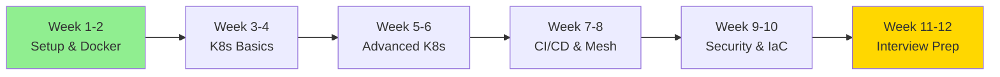

# Master DevOps Learning Path
## Complete Roadmap - Basics to Advanced (3+ Years Experience)

---

## 🎯 Learning Objectives

This master path combines all learning materials into a **12-week structured program** designed for DevOps interview preparation with hands-on practice.

---

## 📚 Available Learning Materials

### Core Guides
1. **[DevOps Interview Prep](devops-interview-prep.md)** - Core concepts & interview questions
2. **[Hands-On Practice](hands-on-practice.md)** - Real projects & exercises
3. **[Advanced Kubernetes](advanced-kubernetes.md)** - Production patterns
4. **[Local Environment Setup](local-environment-setup.md)** - Complete dev setup
5. **[Full Stack Path](fullstack-devops-kubernetes-learning-path.md)** - Complete overview

---

## 🗓️ 12-Week Learning Schedule

### Week 1: Environment Setup & Docker Fundamentals

**Goals**: Set up complete local environment, master Docker basics

#### Day 1-2: Environment Setup
- [ ] Install Docker Desktop and enable Kubernetes
- [ ] Install kubectl, Helm, k9s, kubectx
- [ ] Install Istio and monitoring tools
- [ ] Verify all installations
- [ ] Deploy hello-world application

📖 **Reference**: [Local Environment Setup](local-environment-setup.md)

#### Day 3-4: Docker Basics
- [ ] Understand Docker architecture (images, containers, layers)
- [ ] Practice Docker commands (build, run, exec, logs)
- [ ] Create basic Dockerfiles
- [ ] Use .dockerignore effectively
- [ ] Push images to Docker Hub

📖 **Reference**: [DevOps Interview Prep](devops-interview-prep.md) - Section 4

#### Day 5-6: Docker Advanced
- [ ] Multi-stage builds
- [ ] Docker Compose for multi-container apps
- [ ] Volume management
- [ ] Networks and port mapping
- [ ] Health checks

📖 **Reference**: [Hands-On Practice](hands-on-practice.md) - Exercise 1

#### Day 7: Practice Project
**Project**: Containerize a Node.js + PostgreSQL application
- [ ] Create optimized Dockerfile with multi-stage build
- [ ] Write docker-compose.yml with all services
- [ ] Implement health checks
- [ ] Achieve image size < 150MB
- [ ] Document the setup

**Interview Questions to Prepare**:
- Explain Docker layer caching
- CMD vs ENTRYPOINT difference
- How to reduce image size
- Docker networking modes

---

### Week 2: Git, Linux, and CI/CD Basics

#### Day 1-2: Git Mastery
- [ ] Advanced Git commands (rebase, cherry-pick, reflog)
- [ ] Merge conflict resolution
- [ ] Git workflows (GitFlow, trunk-based)
- [ ] Pull requests and code reviews

📖 **Reference**: [DevOps Interview Prep](devops-interview-prep.md) - Section 2

#### Day 3-4: Linux & Shell Scripting
- [ ] Essential Linux commands
- [ ] Process management (ps, top, kill, systemctl)
- [ ] File operations and permissions
- [ ] Network commands (netstat, curl, wget)
- [ ] Write bash deployment script

📖 **Reference**: [DevOps Interview Prep](devops-interview-prep.md) - Section 3

#### Day 5-7: CI/CD Introduction
- [ ] Understand CI/CD concepts
- [ ] Create basic GitHub Actions workflow
- [ ] Add automated testing
- [ ] Docker image build and push
- [ ] Deploy to container registry

📖 **Reference**: [Hands-On Practice](hands-on-practice.md) - Exercise 3

**Practice Project**: Create CI/CD pipeline for your Week 1 project

---

### Week 3-4: Kubernetes Fundamentals

#### Week 3: Core Kubernetes Concepts

**Day 1-2: Architecture & Setup**
- [ ] Understand K8s architecture (control plane, worker nodes)
- [ ] Learn kubectl basics
- [ ] Create your first pod, deployment
- [ ] Understand namespaces
- [ ] Practice kubectl commands

📖 **Reference**: [DevOps Interview Prep](devops-interview-prep.md) - Section 5

**Day 3-4: Deployments & Services**
- [ ] Create deployments with replicas
- [ ] Rolling updates and rollbacks
- [ ] Resource requests and limits
- [ ] Service types (ClusterIP, NodePort, LoadBalancer)
- [ ] Service discovery

**Day 5-6: ConfigMaps & Secrets**
- [ ] Create and use ConfigMaps
- [ ] Manage Secrets securely
- [ ] Environment variables injection
- [ ] Volume mounts for config

**Day 7: Practice**
- [ ] Deploy multi-tier application (frontend + backend + db)
- [ ] Use ConfigMaps for configuration
- [ ] Use Secrets for passwords
- [ ] Expose via LoadBalancer service

📖 **Reference**: [Hands-On Practice](hands-on-practice.md) - Exercise 2.1

#### Week 4: Advanced Kubernetes Resources

**Day 1-2: Persistent Storage**
- [ ] PersistentVolumes and PersistentVolumeClaims
- [ ] Storage classes
- [ ] StatefulSets basics
- [ ] Volume access modes

**Day 3-4: Networking**
- [ ] Understand Kubernetes networking model
- [ ] Ingress controllers and rules
- [ ] Network policies
- [ ] DNS in Kubernetes

**Day 5-6: Health & Probes**
- [ ] Liveness probes
- [ ] Readiness probes
- [ ] Startup probes
- [ ] Graceful shutdowns

**Day 7: Practice**
- [ ] Deploy StatefulSet (PostgreSQL or MongoDB)
- [ ] Configure Ingress with TLS
- [ ] Implement health checks
- [ ] Test rolling updates

📖 **Reference**: [Hands-On Practice](hands-on-practice.md) - Exercise 2.1

**Interview Questions**:
- Deployment vs StatefulSet
- Service discovery mechanism
- Pod lifecycle phases
- How rolling updates work

---

### Week 5-6: Advanced Kubernetes Patterns

#### Week 5: Design Patterns

**Day 1-2: Init Containers**
- [ ] Understand init container use cases
- [ ] Database migration pattern
- [ ] Dependency waiting pattern
- [ ] Configuration setup pattern
- [ ] Implement init container examples

📖 **Reference**: [Advanced Kubernetes](advanced-kubernetes.md) - Section 2

**Day 3-4: Sidecar Pattern**
- [ ] Logging sidecar (Fluentd)
- [ ] Metrics exporter sidecar
- [ ] Proxy sidecar (Cloud SQL, Ambassador)
- [ ] Implement 3 sidecar examples

📖 **Reference**: [Advanced Kubernetes](advanced-kubernetes.md) - Section 1

**Day 5-6: Deployment Strategies**
- [ ] Understand deployment strategies
- [ ] Implement canary deployment
- [ ] Implement blue-green deployment
- [ ] Practice traffic splitting
- [ ] Write switching scripts

📖 **Reference**: [Advanced Kubernetes](advanced-kubernetes.md) - Section 3

**Day 7: Practice**
**Project**: Deploy application with:
- [ ] Init container for DB migration
- [ ] Logging sidecar
- [ ] Blue-green deployment setup
- [ ] Document the architecture

#### Week 6: StatefulSets & Operators

**Day 1-3: StatefulSets**
- [ ] Deploy Kafka cluster with StatefulSet
- [ ] Deploy MongoDB replica set
- [ ] Understand stable network IDs
- [ ] Practice scaling stateful apps
- [ ] Volume management

📖 **Reference**: [Advanced Kubernetes](advanced-kubernetes.md) - Section 5

**Day 4-6: CRDs & Operators**
- [ ] Understand Custom Resource Definitions
- [ ] Create simple CRD
- [ ] Install existing operators (Prometheus, cert-manager)
- [ ] Understand operator pattern
- [ ] Explore Operator SDK

**Day 7: Practice & Review**
- [ ] Review all K8s topics
- [ ] Practice kubectl commands
- [ ] Complete troubleshooting scenarios
- [ ] Prepare for mock interview

📖 **Reference**: [Hands-On Practice](hands-on-practice.md) - Exercise 4

---

### Week 7-8: CI/CD & Service Mesh

#### Week 7: Complete CI/CD Pipeline

**Day 1-3: GitHub Actions Deep Dive**
- [ ] Multi-job workflows
- [ ] Matrix builds
- [ ] Caching strategies
- [ ] Secrets management
- [ ] Deployment automation

📖 **Reference**: [Hands-On Practice](hands-on-practice.md) - Exercise 3.1

**Day 4-5: Jenkins Pipeline**
- [ ] Jenkinsfile syntax
- [ ] Pipeline stages
- [ ] Docker integration
- [ ] Kubernetes deployment
- [ ] Notifications (Slack)

**Day 6-7: GitOps with ArgoCD**
- [ ] Install ArgoCD
- [ ] Deploy application via ArgoCD
- [ ] Auto-sync configuration
- [ ] Rollback strategies
- [ ] Multi-environment setup

**Project**: Complete CI/CD pipeline
- [ ] GitHub Actions for build & test
- [ ] Docker image creation
- [ ] ArgoCD for deployment
- [ ] Monitoring integration

#### Week 8: Service Mesh (Istio)

**Day 1-2: Istio Installation & Basics**
- [ ] Install Istio on local cluster
- [ ] Understand sidecar injection
- [ ] Deploy sample application with Istio
- [ ] Access Kiali dashboard

📖 **Reference**: [Advanced Kubernetes](advanced-kubernetes.md) - Section 4

**Day 3-4: Traffic Management**
- [ ] VirtualService configuration
- [ ] DestinationRules
- [ ] Traffic splitting (80/20, 50/50)
- [ ] Circuit breakers
- [ ] Retries and timeouts

**Day 5-6: Security & Observability**
- [ ] Mutual TLS (mTLS) configuration
- [ ] Authorization policies
- [ ] Rate limiting
- [ ] Distributed tracing with Jaeger
- [ ] Metrics with Prometheus

**Day 7: Practice**
**Project**: Implement service mesh for microservices
- [ ] Deploy 3 microservices with Istio
- [ ] Configure canary deployment with traffic splitting
- [ ] Enable mTLS
- [ ] Set up monitoring dashboards

---

### Week 9-10: Security, Monitoring & IaC

#### Week 9: Security & RBAC

**Day 1-2: Kubernetes Security**
- [ ] Pod Security Standards
- [ ] Security contexts
- [ ] Run as non-root
- [ ] Read-only filesystems
- [ ] Capability dropping

📖 **Reference**: [Advanced Kubernetes](advanced-kubernetes.md) - Section 6

**Day 3-4: RBAC (Role-Based Access Control)**
- [ ] Roles and ClusterRoles
- [ ] RoleBindings and ClusterRoleBindings
- [ ] Service accounts
- [ ] Testing permissions (kubectl auth can-i)
- [ ] Least privilege principle

**Day 5-6: Network Policies**
- [ ] Default deny policies
- [ ] Allow specific traffic
- [ ] Namespace isolation
- [ ] Egress policies
- [ ] Testing network policies

**Day 7: Security Scanning**
- [ ] Image scanning with Trivy
- [ ] Vulnerability scanning
- [ ] Secret scanning
- [ ] Policy enforcement with OPA

#### Week 10: Monitoring & IaC

**Day 1-3: Monitoring & Observability**
- [ ] Deploy Prometheus Operator
- [ ] Create ServiceMonitors
- [ ] Write PrometheusRules for alerts
- [ ] Create Grafana dashboards
- [ ] ELK stack for logging

📖 **Reference**: [Advanced Kubernetes](advanced-kubernetes.md) - Section 7

**Day 4-6: Infrastructure as Code**
- [ ] Terraform basics
- [ ] Create VPC with Terraform
- [ ] Deploy EKS/GKE cluster
- [ ] Ansible playbooks
- [ ] Configuration management

📖 **Reference**: [DevOps Interview Prep](devops-interview-prep.md) - Section 7

**Day 7: Practice**
**Project**: Complete monitoring setup
- [ ] Prometheus for metrics
- [ ] Grafana dashboards
- [ ] Alert manager configuration
- [ ] Log aggregation with ELK

---

### Week 11-12: Interview Preparation & Final Project

#### Week 11: Mock Interviews & Scenarios

**Day 1-2: Scenario-Based Practice**
- [ ] Pod CrashLoopBackOff debugging
- [ ] Service not accessible troubleshooting
- [ ] High CPU usage investigation
- [ ] Database migration during deployment
- [ ] Zero-downtime deployment implementation

📖 **Reference**: [Hands-On Practice](hands-on-practice.md) - Exercise 4

**Day 3-4: Interview Questions Practice**
- [ ] Review all core concepts
- [ ] Practice explaining architectures
- [ ] Prepare STAR method answers
- [ ] Record yourself explaining topics
- [ ] Practice whiteboarding

📖 **Reference**: [DevOps Interview Prep](devops-interview-prep.md) - All sections

**Day 5-7: Final Review**
- [ ] Review all quick reference cards
- [ ] Practice all kubectl commands
- [ ] Review deployment strategies
- [ ] Practice troubleshooting scenarios
- [ ] Prepare questions for interviewers

#### Week 12: Capstone Project

**Complete Full-Stack Project with DevOps Pipeline**

Build a **Task Management System** with:

**Requirements**:
- [ ] Frontend: React application
- [ ] Backend: Node.js/Express API
- [ ] Database: PostgreSQL StatefulSet
- [ ] Cache: Redis deployment
- [ ] Containerization: Multi-stage Dockerfiles
- [ ] Orchestration: Complete K8s manifests
- [ ] Init containers for DB migrations
- [ ] Sidecar for logging
- [ ] CI/CD: GitHub Actions pipeline
- [ ] Deployment: Blue-green or canary strategy
- [ ] Service Mesh: Istio configuration
- [ ] Monitoring: Prometheus + Grafana
- [ ] Security: RBAC, network policies, mTLS
- [ ] Documentation: Architecture diagrams, README

📖 **Reference**: [Hands-On Practice](hands-on-practice.md) - Exercise 5

**Deliverables**:
1. Complete source code in GitHub
2. All Kubernetes manifests
3. CI/CD pipeline configuration
4. Architecture documentation
5. Demo video/walkthrough
6. Interview presentation ready

---

## Daily Practice Schedule

### Weekday Schedule (2-3 hours/day)

**Evening (After Work)**:
- **6:00 PM - 6:30 PM**: Review previous day's concepts
- **6:30 PM - 7:30 PM**: Learn new topic (video/reading)
- **7:30 PM - 8:30 PM**: Hands-on practice
- **8:30 PM - 9:00 PM**: Document learnings, update notes

### Weekend Schedule (4-6 hours/day)

**Saturday**:
- **Morning (9 AM - 12 PM)**: Deep dive into new topics
- **Afternoon (2 PM - 4 PM)**: Hands-on projects
- **Evening (5 PM - 6 PM)**: Review and practice

**Sunday**:
- **Morning (9 AM - 11 AM)**: Practice interview questions
- **Afternoon (2 PM - 5 PM)**: Build projects/complete exercises
- **Evening (6 PM - 7 PM)**: Weekly review and planning

---

## Progress Tracking Checklist

### Fundamentals ✓
- [ ] Docker concepts mastered
- [ ] Git workflows comfortable
- [ ] Linux commands fluent
- [ ] Shell scripting practiced

### Kubernetes Core ✓
- [ ] K8s architecture understood
- [ ] kubectl commands memorized
- [ ] Deployed multi-tier application
- [ ] Troubleshooting scenarios completed

### Advanced Kubernetes ✓
- [ ] Sidecar patterns implemented
- [ ] Deployment strategies practiced
- [ ] StatefulSets deployed
- [ ] CRDs and operators explored

### CI/CD & Automation ✓
- [ ] GitHub Actions pipeline created
- [ ] Jenkins pipeline configured
- [ ] ArgoCD deployed applications
- [ ] GitOps workflow implemented

### Service Mesh ✓
- [ ] Istio installed and configured
- [ ] Traffic management practiced
- [ ] mTLS enabled
- [ ] Observability dashboards setup

### Security & Monitoring ✓
- [ ] RBAC configured
- [ ] Network policies applied
- [ ] Prometheus monitoring setup
- [ ] Grafana dashboards created

### Interview Ready ✓
- [ ] All concepts can be explained clearly
- [ ] Troubleshooting scenarios practiced
- [ ] STAR method responses prepared
- [ ] Capstone project completed
- [ ] Resume updated with projects

---

## Interview Preparation Tips

### Technical Preparation
1. **Explain Architecture**: Practice drawing and explaining K8s architecture
2. **Live Coding**: Be ready for live kubectl commands during interview
3. **Troubleshooting**: Practice debugging scenarios on the spot
4. **Design Questions**: Prepare to design CI/CD pipelines, K8s architectures

### Behavioral Preparation
1. **STAR Method**: Prepare 5-7 stories using Situation, Task, Action, Result
2. **Project Discussion**: Be ready to deep dive into your capstone project
3. **Challenges**: Prepare examples of technical challenges you solved
4. **Team Work**: Examples of collaboration and mentoring

### Company Research
- [ ] Research company's tech stack
- [ ] Understand their DevOps maturity
- [ ] Prepare relevant questions
- [ ] Review job description thoroughly

---

## Resource Quick Links

### Documentation
- [Kubernetes Docs](https://kubernetes.io/docs/)
- [Docker Docs](https://docs.docker.com/)
- [Istio Docs](https://istio.io/docs/)
- [Helm Charts](https://helm.sh/)

### Practice Platforms
- [Play with Kubernetes](https://labs.play-with-k8s.com/)
- [KillerCoda Scenarios](https://killercoda.com/)
- [Katacoda (archived)](https://www.katacoda.com/)

### Your Learning Materials
1. [Local Environment Setup](local-environment-setup.md)
2. [DevOps Interview Prep](devops-interview-prep.md)
3. [Hands-On Practice](hands-on-practice.md)
4. [Advanced Kubernetes](advanced-kubernetes.md)
5. [Full Stack Path](fullstack-devops-kubernetes-learning-path.md)

---

## Success Metrics

### Week 4 Checkpoint
- [ ] Can deploy and manage basic K8s applications
- [ ] Comfortable with Docker and docker-compose
- [ ] Created first CI/CD pipeline

### Week 8 Checkpoint
- [ ] Deployed applications with advanced patterns
- [ ] Implemented service mesh
- [ ] Configured monitoring and alerting

### Week 12 Checkpoint
- [ ] Completed capstone project
- [ ] Can explain all concepts clearly
- [ ] Ready for technical interviews
- [ ] Confident in troubleshooting

---

## Final Notes

> [!IMPORTANT]
> **Consistency is Key**: Daily practice is more important than marathon sessions. Even 1 hour daily is better than 10 hours once a week.

> [!TIP]
> **Document Everything**: Keep a learning journal. Write down what you learn, problems you solve, and insights you gain. This helps in interviews.

> [!WARNING]
> **Don't Skip Fundamentals**: Advanced topics build on basics. Make sure you truly understand Docker and K8s fundamentals before moving to service mesh.

---

## Next Steps

1. **Start Now**: Set up your environment today (Week 1, Day 1)
2. **Create Schedule**: Block time in your calendar
3. **Join Community**: Participate in DevOps communities (Reddit, Discord)
4. **Stay Updated**: Follow DevOps blogs and podcasts
5. **Network**: Connect with DevOps engineers on LinkedIn

---

**You have all the resources you need. Now it's time to execute!** 💪

**Target**: Land your DevOps role in 12 weeks! 🎯

Good luck on your journey! 🚀
